# NOSi GITLab

**Passo 1**: Vamos para [GitLab] (https://git.nosi.cv/users/sign_in) e fazer o _login_ (ver a imagem a segui) com as mesmas credenciais da conta NOSi, com _username_ sem o @nosi.cv.
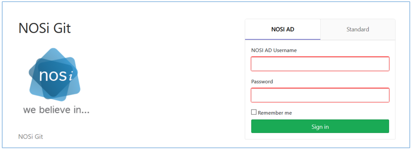

**Passo2**: Na página seguinte (ver a figura abaixo), criamos um novo projeto, clicando no botão assinalado com a seta.
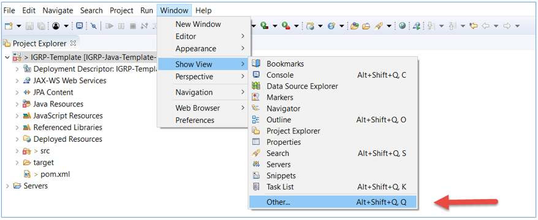

**Passo 3**: No formulário seguinte (imagem a seguir), definimos o nome do projeto, o nível de visibilidade e clicamos sobre o botão **Create project**.   
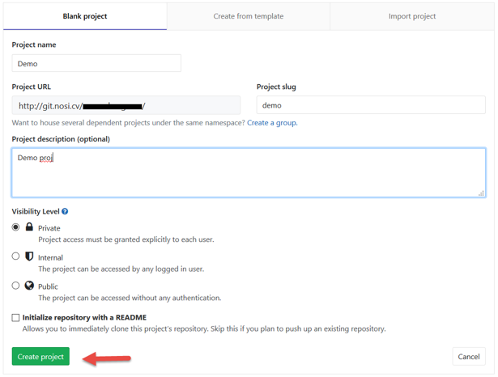

**Passo 4**: A partir deste momento temos o nosso repositório pronto para receber um projecto (imagem a seguir). Aqui, ao clicarmos sobre o botão **Clone**, abre-se uma pequena aba onde podemos copiar o URL do repositório (assinalado pela seta), para podermos alojar e partilhar um projeto.
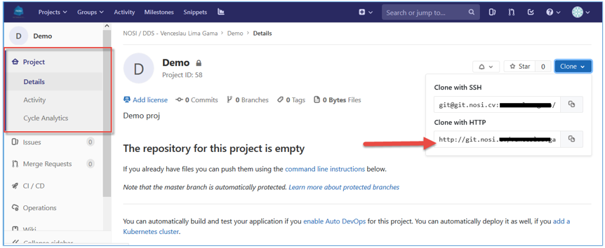

**Passo 5**: Partindo do princípio de que já temos o IGRP Template importado no nosso Eclipse, vamos para _Window->Show View->Other_ e na janela que se abre selecionamos _Git Repositories_ e clicamos no **Open**.

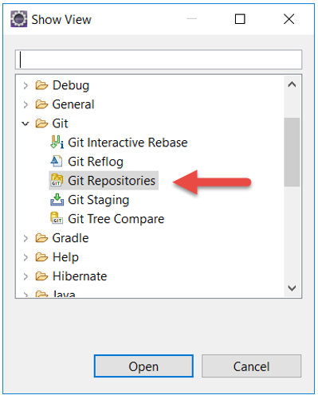

**Passo 6**: No Guia, que então se torna visível, expandimos as pastas do nosso IGRP Template, fazemos _click_ direito sobre **_Remotes_** e escolhemos **_Create Remote_**.

**Passo 7**: Em seguida, na janela que se abre damos um nome ao repositório remoto, selecionamos _Configure push_ e clicamos em **OK**.
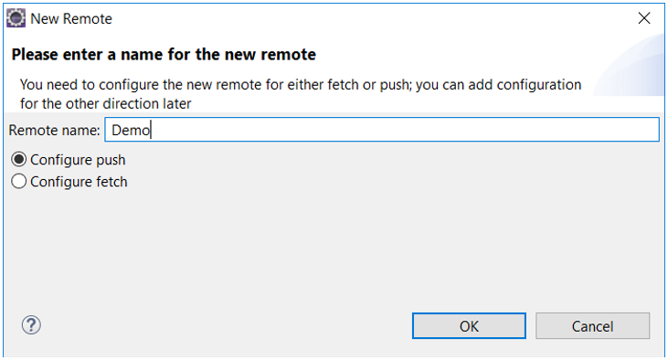

**Passo 8**: Na janela seguinte, clicamos em **Change...** e na janela que se abre, colamos no campo URL o _link_ que copiamos no repositório que criamos anteriormente no NOSi GTILab. Os outros campos são automaticamente preenchidos, clicamos no **Finish**  para prosseguir.
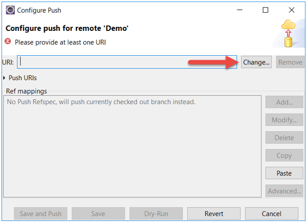

**Passo 9**: No campo URI, colar o URL que copiamos no passo 4.

**Passo 10**: Inserir as credenciais para fazer o _login_.   
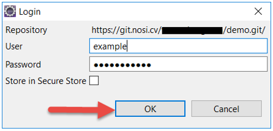

**Passo 11**: Na janela que se abre a seguir, clicamos em **Close** e aguardamos o Eclipse terminar a operação.
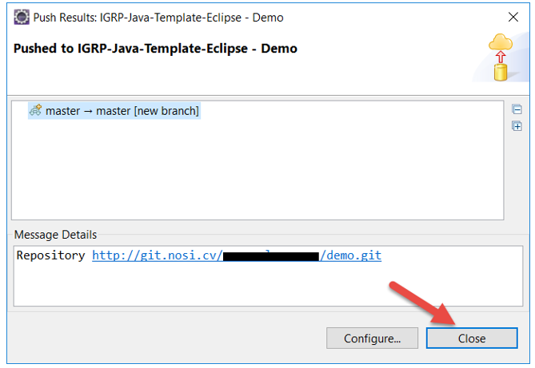

**Passo 12**: Finalizada a operação no IDE Eclipse ,fazemos _Refresh_ na página do nosso repositório e podemos ver os nosso IGRP Template.   
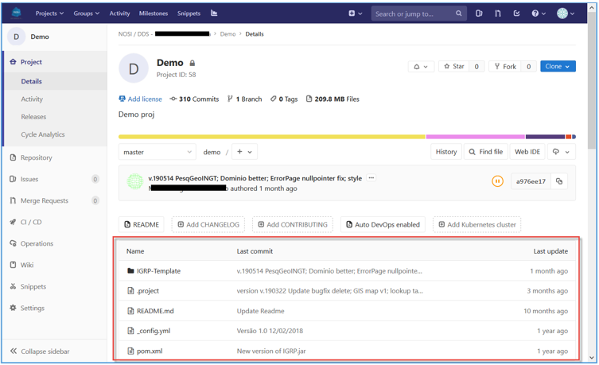
### 1. Partilhando um projeto

Uma vez hospedado o nosso projeto no NOSi GITLab, conforme descrito no capítulo anterior, podemos partilhá-lo com outros desenvolvedores com credenciais para _login_ no repositório.
Então, estando dentro do nosso projeto (ver a imagem a seguir), no menu lateral vamos para _Settings->Members_ e preenchemos o formulário, selecionando membros na lista disponível, privilégios e período vigente da partilha e clicamos no botão **Add to project**.  
Quem nunca tiver feito login no repositório deve entrar pelo menos uma vez para que possa aparecer na lista e, assim, ser convidado.
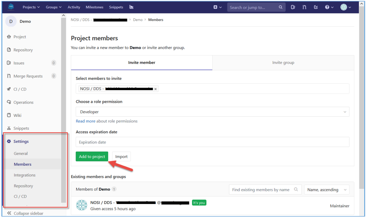

Os utilizadores convidados aparecem no fim da mesma página na lista da imagem a seguir, a partir de onde podem ser geridos pelo _Maintainer_ do repositório.   

### 2. Importando um projeto do repositório NOSi GITLab

Uma vez convidado a um projeto, o membro deve fazer a importação do mesmo para o Eclipse no seu computador, para poder contribuir.   
O processo é similar ao de importação do IGRP Template, porém o _link_ de importação, que copiamos conforme as duas imagens do ponto **1.1** deste documento, agora passa a ser copiado como mosta a imagem do passo **4**.   
Ainda, desta vez serão solicitadas credenciais (vera imagem abaixo) e o utilizador deve inserir as credencias da sua conta NOSi, sem @nosi.cv.   
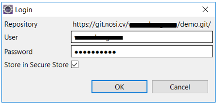

O resto do processo de importação e configuração pode ser feito acompanhando o documento [Execução do Projeto no Intellij IDE](<../../Get Started/Execução do Projeto no Intellij IDE.md>).

### 3. Sincronização de projeto entre o colaboradores participantes

Uma vez que o projeto foi hospedado e partilhado, a atualização do Template passará a ser feita pelo utilizador que fez o seu _upload_. Este atualiza seu IGRP Template fazendo _Pull_ das atualizações do Template no GitHub e faz _commit_ do mesmo para o NOSi GitLab. A partir de então, os outros utilizadores podem fazer _Pull_ do seu Template e todos terão o Template atualizado.

Relativamente aos projetos/aplicações desenvolvidos no IGRP Template, todos os colaboradores podem fazer _commit_ da parte que desenvolveram, ficando disponível para os outros fazerem _Pull_ para baixar esse conteúdo.

