# Primeiros Passos

## Login
O processo de login é realizado através do Keycloak. O utilizador deve clicar no botão **"Sign in with Keycloak"** e inserir as credenciais (nome de utilizador e senha) de configuração. 

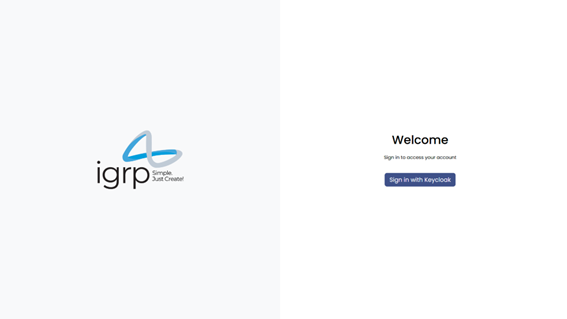

## Navegação

### Navbar
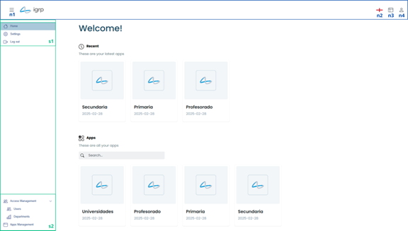
- **n1**: Expande/recolhe a Sidebar.
- **n2**: Altera o idioma da aplicação.
- **n3**: Acesso rápido a aplicações recentes.
- **n4**: Menu de perfil, onde o utilizador pode editar o perfil e fazer logout.

### Sidebar
- **s1**: Atalhos comuns a todos os utilizadores, como tela inicial, configurações da aplicação e logout.
- **s2**: Atalhos exclusivos para administradores, como gerenciamento de utilizadores, departamentos e aplicações.

## Gestão de Utilizadores

### Filtrar Utilizadores

Utilize os campos do filtros para filtrar utilizadores por nome, nome de utilizador, e-mail, aplicações, departamentos, papéis ou status.

### Convidar Utilizadores
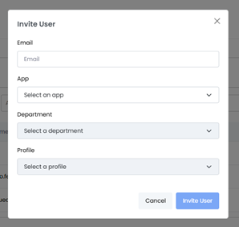

Clique em **"Novo Utilizador"** para abrir um modal e preencher os campos necessários para convidar um novo utilizador. O utilizador receberá um e-mail com as credenciais de acesso.

## Gestão de Departamentos

### Criar Departamento
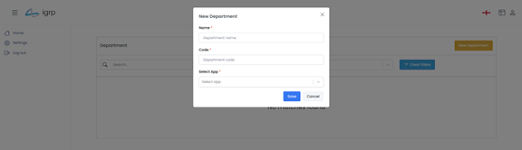

Clique no botão **"Novo Departamento"** e preencha os campos necessários, como nome, código e aplicação associada.

### Adicionar Permissões ao Departamento
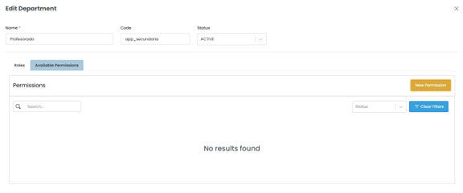

Acesse a configuração do departamento e clique na seção **"Permissões Disponíveis"** para adicionar ou remover permissões.

## Gestão de Aplicações

### Criar Aplicação
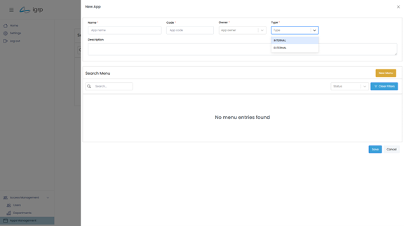

No botão **"Nova Aplicação"** acede-se ao formulário para preenchimento dos campos necessários, como nome, URL e código.

### Criar Menus
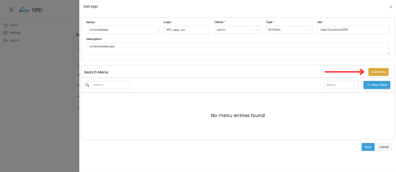

Acesse a seção de edição da aplicação e clique em **"Novo Menu"** para criar menus do tipo **Grupo, Página ou Externo**.

## Perfil do Utilizador

### Atualizar Perfil
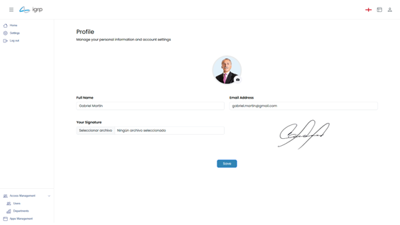

Acesse o menu de perfil no **Navbar** para atualizar a foto, nome, e-mail e assinatura do utilizador.

## Gestão de Permissões

### Adicionar Permissões a Papéis

Acesse a configuração do departamento e clique em **"Nova permissão"** para criar um novo papel e atribuir permissões específicas.

### Atribuir Permissões a Utilizadores

Na gestão de utilizadores, é possível atribuir permissões diretamente a utilizadores ou através de papéis associados a departamentos.

## Gestão de Páginas

### Criar Páginas
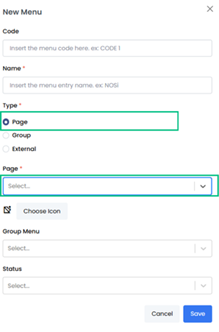

Na gestão de aplicações, acesse a seção de edição da aplicação e crie novas páginas que podem ser acessadas através dos menus.

### Visualizar Páginas
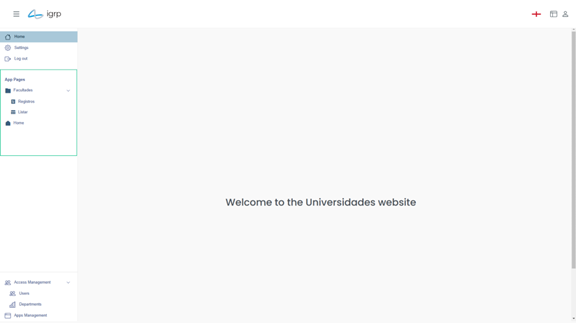

As páginas criadas podem ser visualizadas e acessadas diretamente através da **Sidebar** ou do menu de navegação da aplicação.

## Gestão de Menus

### Criar Menus

Na gestão de aplicações, acesse a seção de edição da aplicação e crie menus do tipo **Grupo, Página ou Externo**.

### Reordenar Menus

Utilize a funcionalidade de **arrastar e soltar** para reordenar os menus dentro da estrutura de pastas.

## Gestão de Papéis

### Criar Papéis
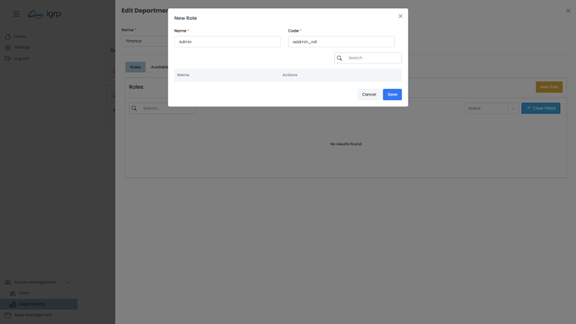

Acesse a configuração do departamento e clique em **"Novo Papel"** para criar um novo papel e atribuir permissões específicas.

### Atribuir Papéis a Utilizadores
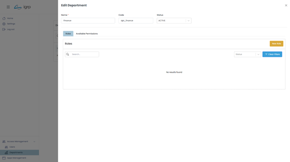

Na gestão de utilizadores, é possível atribuir papéis diretamente a utilizadores ou através de departamentos.