# SPRING BOOT 

# Criar Aplicação Backend Spring Boot com IGRP Studio

Este guia apresenta um passo a passo para criar uma aplicação backend baseada em Spring Boot utilizando o ambiente de desenvolvimento **IGRP Studio**. O processo segue princípios de **Domain-Driven Design (DDD)** e **Clean Architecture**.

## Passo 1: Gerenciamento de Workspaces

O primeiro passo no IGRP Studio é criar e gerir os **workspaces**, que organizam os projetos de desenvolvimento.

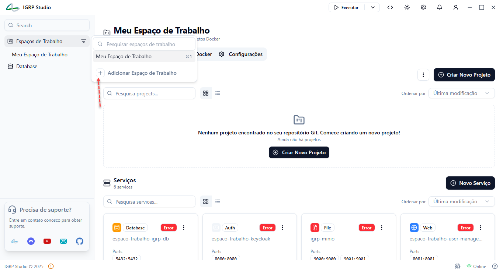

### Funcionalidades:
- Visualizar, criar e pesquisar workspaces existentes
- Aceder às configurações

### Para criar um novo workspace:
- **Nome do workspace**
- **Slug** (identificador único)
- **Descrição**
- **Localização** no sistema de ficheiros

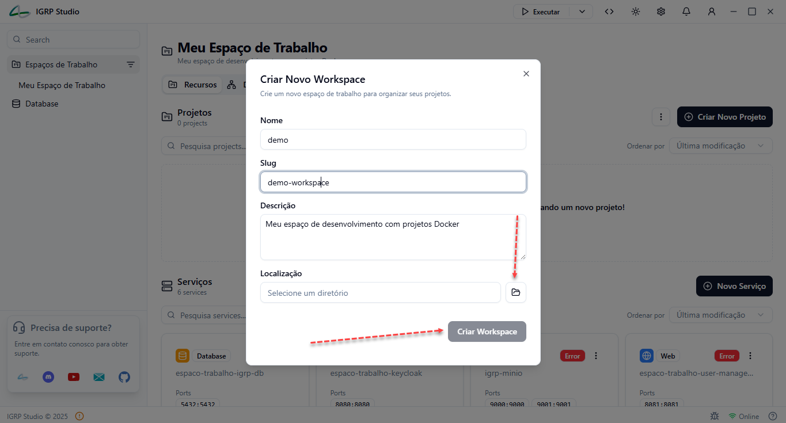

## Passo 2: Criação e Configuração do Projeto

Com o workspace criado, o próximo passo é configurar um **novo projeto backend**.

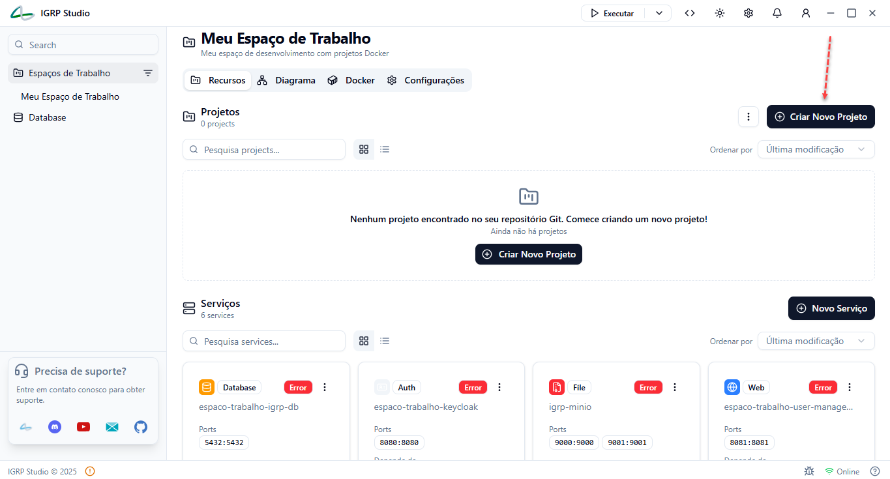

### Etapas da configuração:
1. **Informações do Projeto**
   - Nome
   - Descrição
   - Tipo: `Backend`

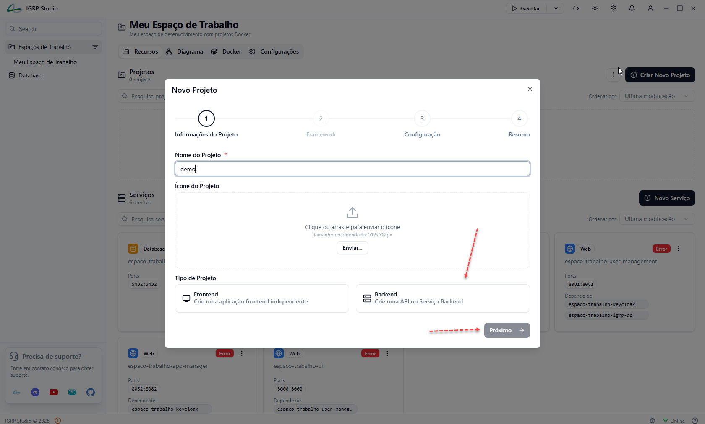

2. **Framework**
   - Selecionar `Spring Boot`

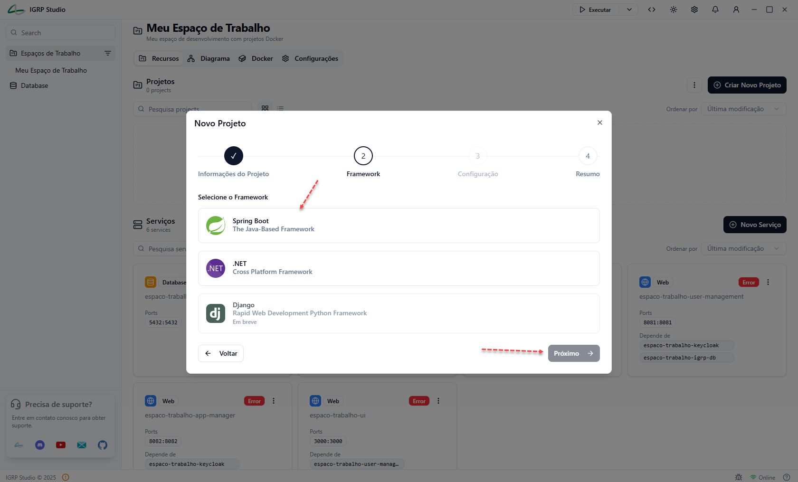

3. **Configuração Técnica**
   - Nome do projeto
   - Grupo (ex: `cv.igrp`)
   - Artefato
   - Versão do IGRP Core
   - Estrutura: `Domain-Driven Design (DDD)`
   - Base de dados: `PostgreSQL`
   - Opções adicionais:
     - Observabilidade
     - Revisão de entidades
     - Suporte a `GraalVM`

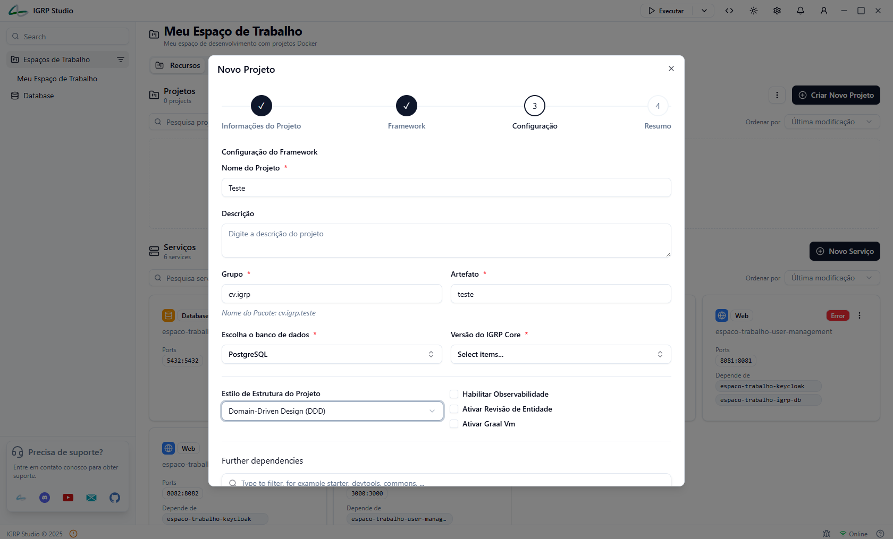
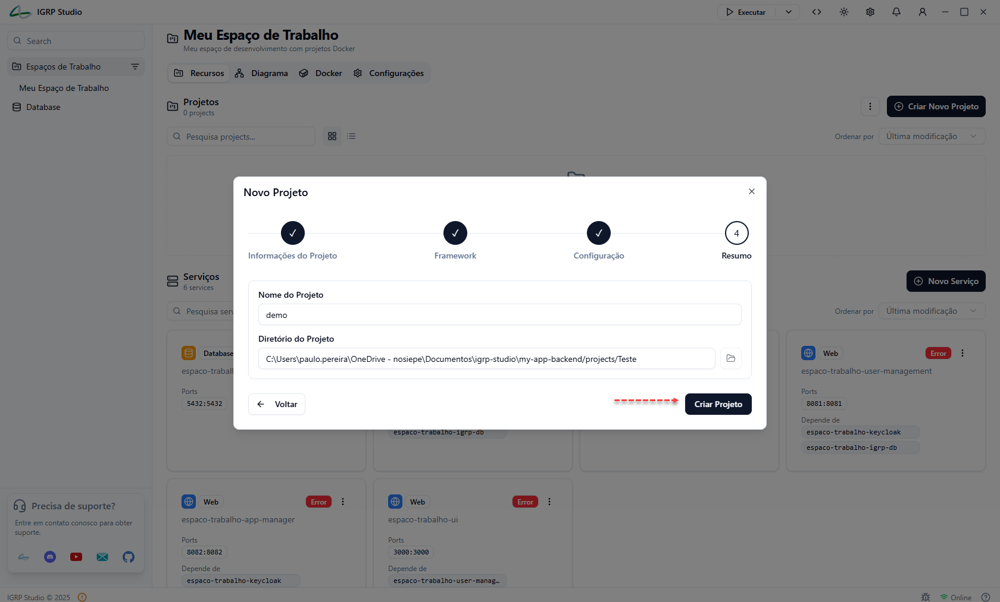

## Passo 3: Criação de Módulos

Organize a aplicação em **módulos**, de acordo com os domínios do negócio.

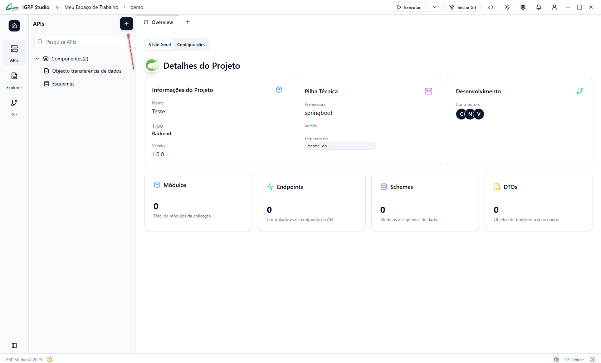

### Para criar um módulo:
1. Clicar em `Novo Módulo`
2. Introduzir o nome (ex: `pessoa`)
3. Guardar o módulo

## Passo 4: Definição de DTOs (Data Transfer Objects)

Crie os **DTOs** responsáveis por transportar dados entre as camadas da aplicação.

  - `idade` (string)
  - `nif` (string)

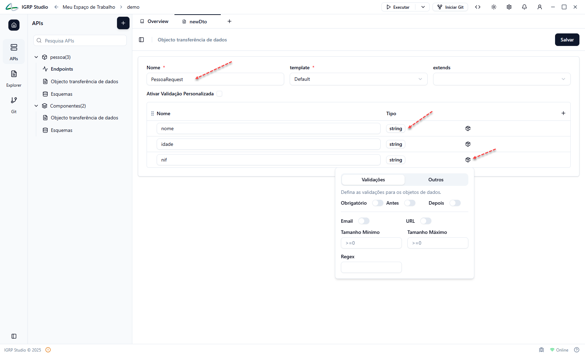

### Configurar validações:
- `Required`, `Email`, `MinLength`, `MaxLength`, entre outros

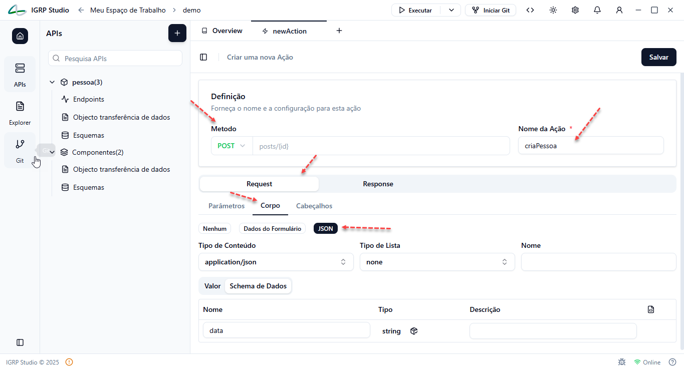

## Passo 5: Definição de Endpoints e Ações

Configure os **endpoints REST** e associe as respetivas ações.

### Exemplo:
- Endpoint: `Pessoa`
  - Base path: `/pessoas`
  - Ações:
    - `criarPessoa` (POST)
    - `obterPessoaPorId` (GET)

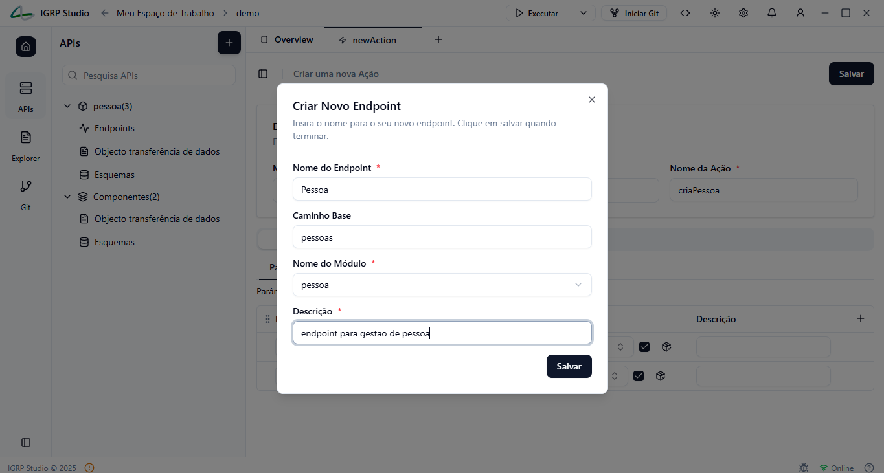

### Configurações para cada ação:
- Método HTTP (`GET`, `POST`, ...)
- Parâmetros e corpo da requisição
- Tipo de conteúdo: `application/json`
- Esquema de resposta

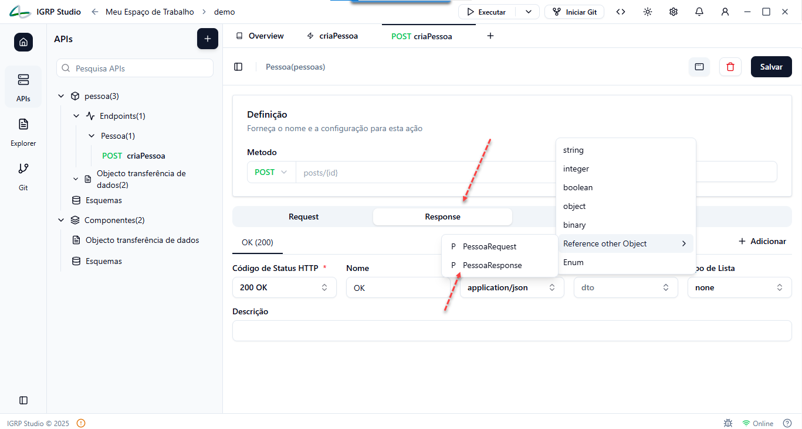

## Implementação Automática

O IGRP Studio gera automaticamente:

- **Controladores** com base nos endpoints definidos
- Implementações de **Commands e Queries** seguindo o padrão **CQRS**:
  - `Command` para criar pessoa
  - `Query` para obter pessoa
  - Handlers correspondentes

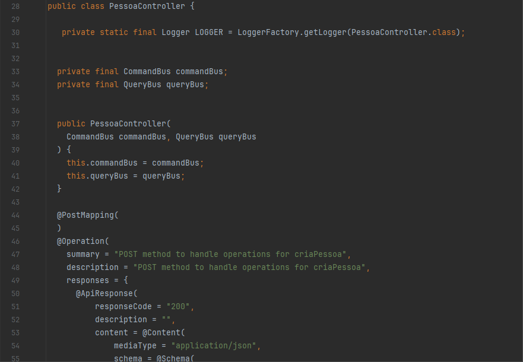

## Modelagem de Entidades

Crie o **modelo de domínio** através de schemas.

### Exemplo: Entidade `Pessoa`
- Campos:
  - `id` (integer, chave primária)
  - `nome` (string)
  - `idade` (string)
  - `nif` (string)
- Configurações:
  - Nome da tabela
  - Auditoria
  - Revisão

O IGRP Studio gera automaticamente:
- Classe da entidade
- Repositórios JPA

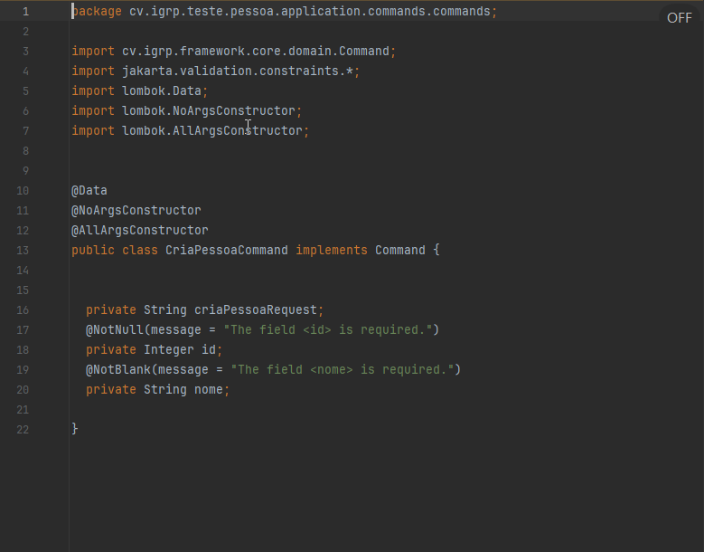

## Passo 9: Configuração do Banco de Dados

As configurações da base de dados são definidas em ficheiros de propriedades.

### Ficheiros principais:
- `application-development.properties`
- `.env` com variáveis de ambiente

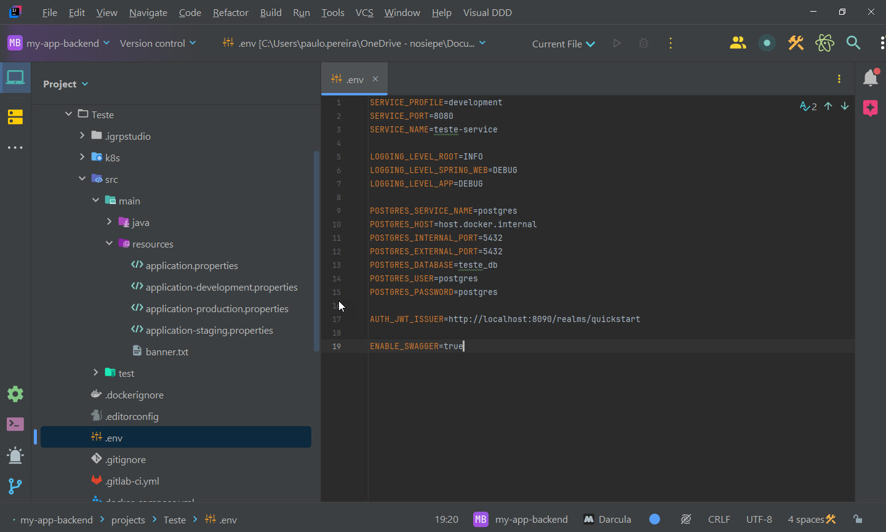

## Módulo Shared

O projeto inclui um módulo especial: `shared`, criado automaticamente.

### Função:
Contém **código reutilizável**, comum a vários domínios (ex: utilitários, constantes, exceções).

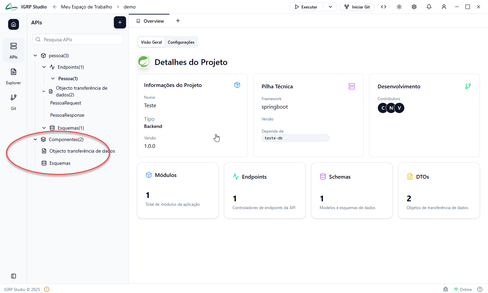

## Considerações Finais

A estrutura criada pelo IGRP Studio respeita os princípios de:
- **Domain-Driven Design (DDD)**
- **Clean Architecture**
- **Separação de responsabilidades**
- **Automação com boas práticas**

