# Diagrama ER

O Spring Engine permite a criação de relacionamentos entre modelos, embora não haja uma implementação automática para gerar o código desses relacionamentos. Os relacionamentos são configurados manualmente no arquivo de configuração do modelo e, em seguida, o modelo é regenerado para refletir as alterações.

**Tipos de Relacionamentos:** 

- **@OneToOne**: Relacionamento um-para-um.
- **@OneToMany**: Relacionamento um-para-muitos.
- **@ManyToMany**: Relacionamento muitos-para-muitos.

> **Nota**: A relação entre entidades deve ser sempre criada a partir do lado do **proprietário (owner)**, pois é ele quem comanda e define a relação no modelo de dados.

Por este motivo, é fundamental **definir primeiro o lado inverso**, para que o lado proprietário possa referenciá-lo corretamente no momento da criação da relação.

Isto garante que o IGRP Studio reconheça e configure corretamente os mapeamentos no código gerado.

## 1. Relação One-to-One (1:1) – Exemplo: País e Presidente

Um país tem um único presidente, e o presidente é responsável por apenas um país.

### 1.1. País – Configuração (lado inverso)

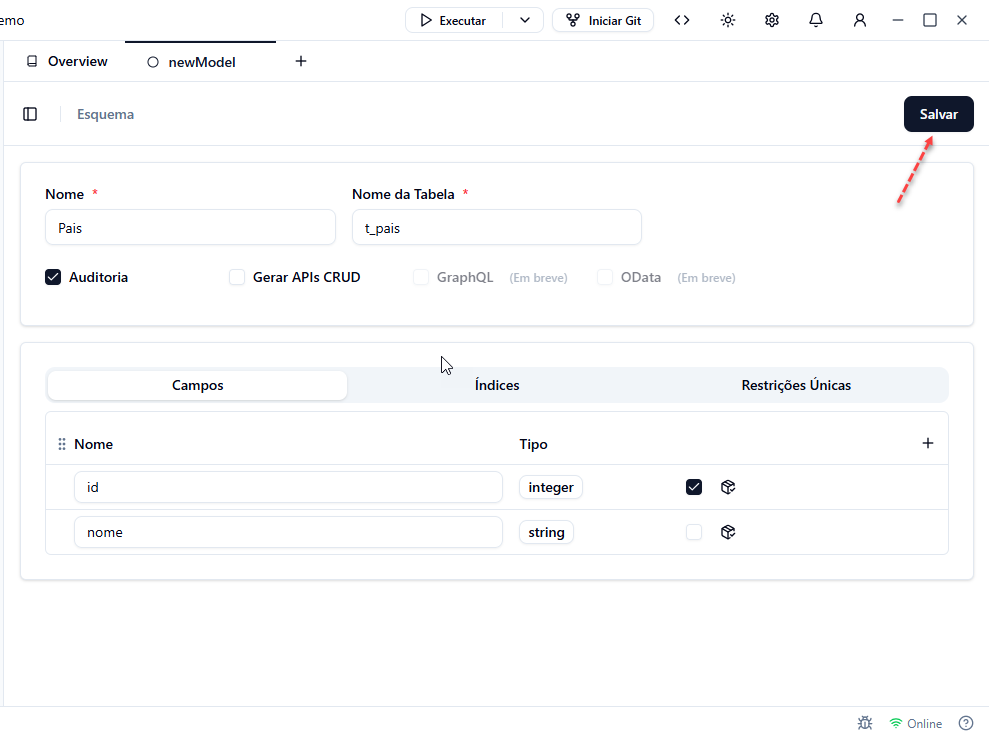

### 1.2. Presidente – Configuração (lado proprietário / owner)

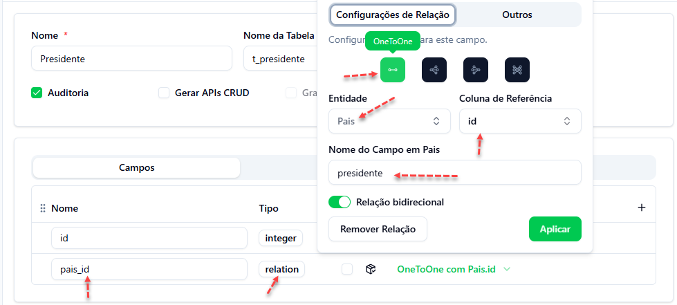

### 1.3. País – Código Gerado (lado inverso)

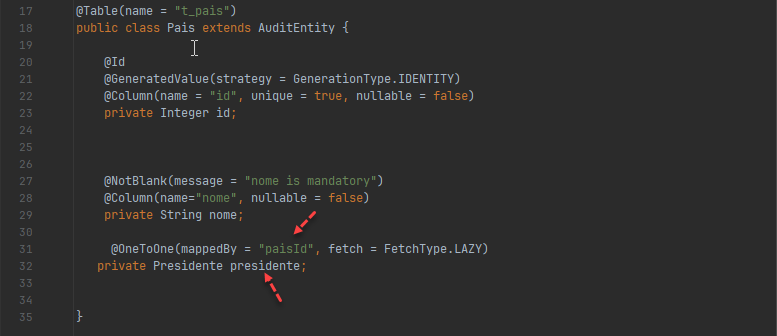

### 1.4. Presidente – Código Gerado (lado proprietário)

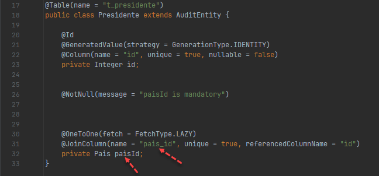

## 2. Relação One-to-Many (1:N) – Exemplo: Estado e Cidade

Um estado pode ter várias cidades, mas cada cidade pertence a um único estado.

### 2.1. Cidade – Configuração (lado inverso)

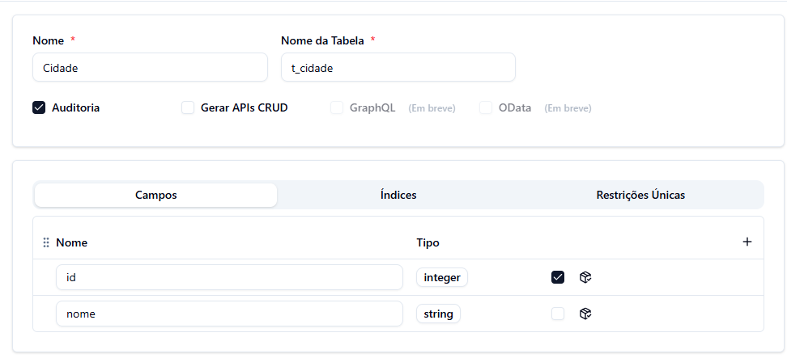

### 2.2. Estado – Configuração (lado proprietário / owner)

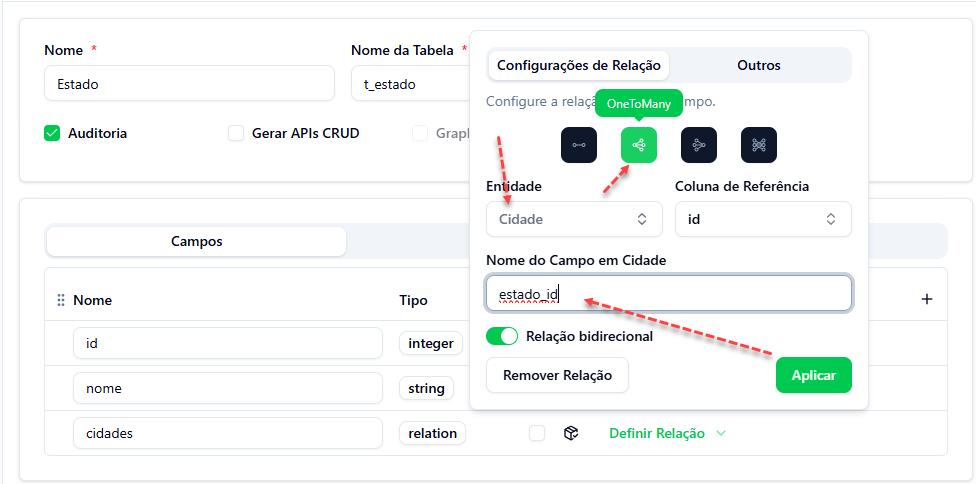
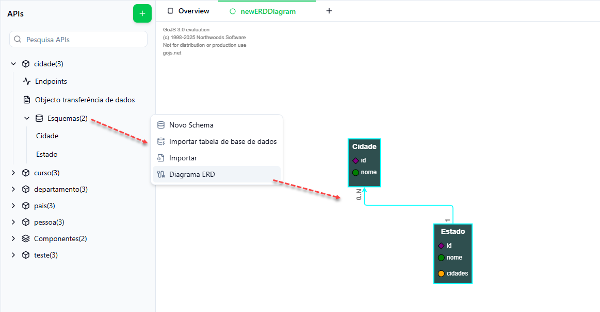

### 2.3. Cidade – Código Gerado (lado inverso)

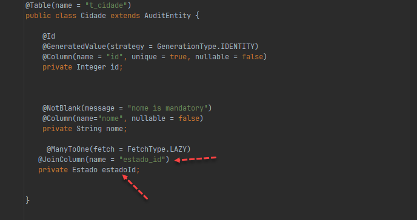

### 2.4. Estado – Código Gerado (lado proprietário)

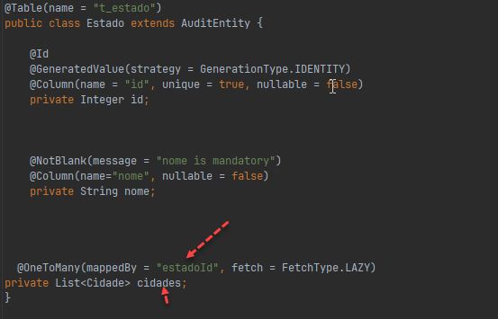

## 3. Relação Many-to-One (N:1) – Exemplo: Funcionário e Departamento

Vários funcionários podem trabalhar no mesmo departamento, mas cada funcionário pertence a apenas um departamento.

### 3.1. Departamento – Configuração (lado inverso)

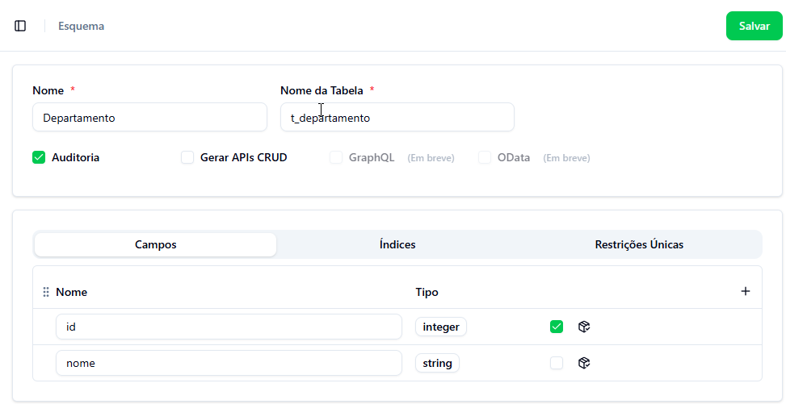

### 3.2. Funcionário – Configuração (lado proprietário / owner)

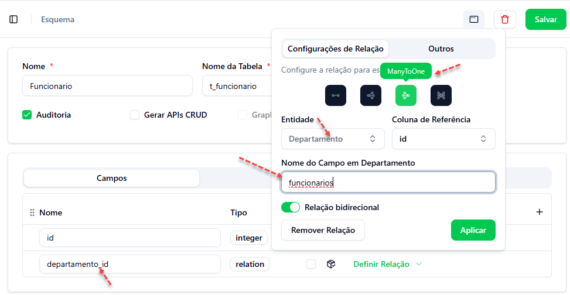

### 3.3. Departamento – Código Gerado (lado inverso)

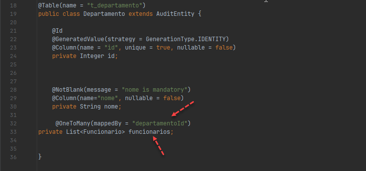

### 3.4. Funcionário – Código Gerado (lado proprietário)

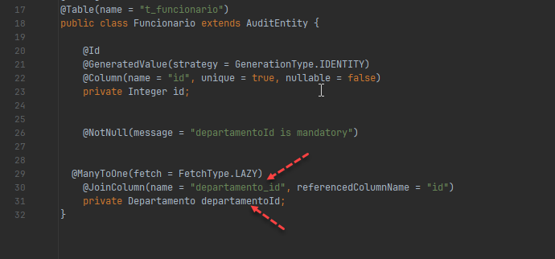

## 4. Relação Many-to-Many (N:M) – Exemplo: Aluno e Curso

Um aluno pode inscrever-se em vários cursos, e cada curso pode ter vários alunos.

### 4.1. Curso – Configuração (lado inverso)

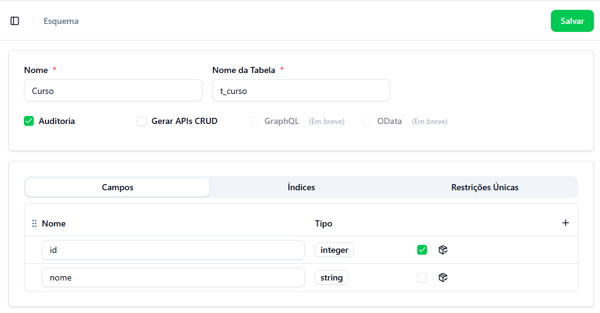

### 4.2. Aluno – Configuração (lado proprietário / owner)

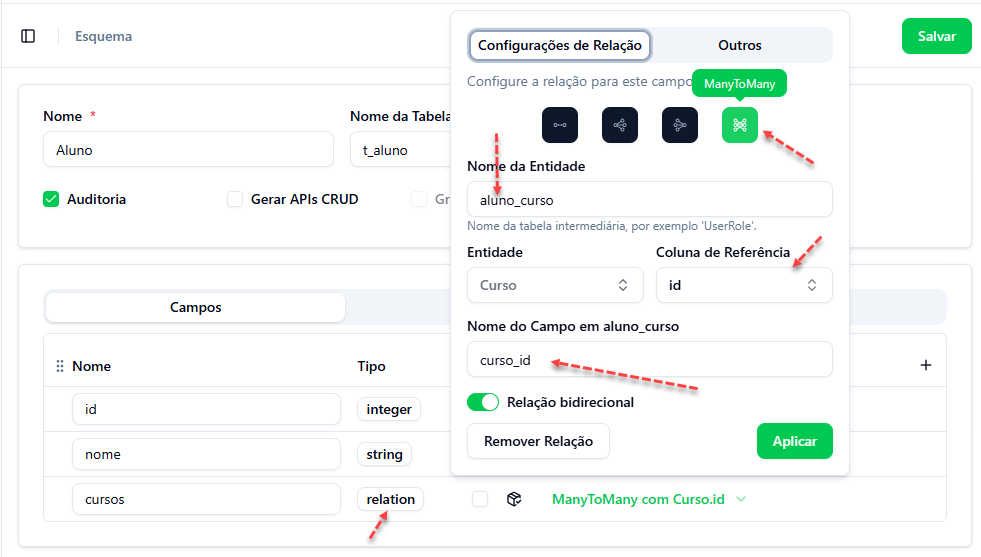

### 4.3. Curso – Código Gerado (lado inverso)

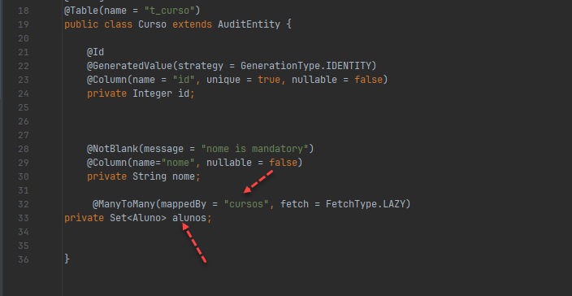

### 4.4. Aluno – Código Gerado (lado proprietário)

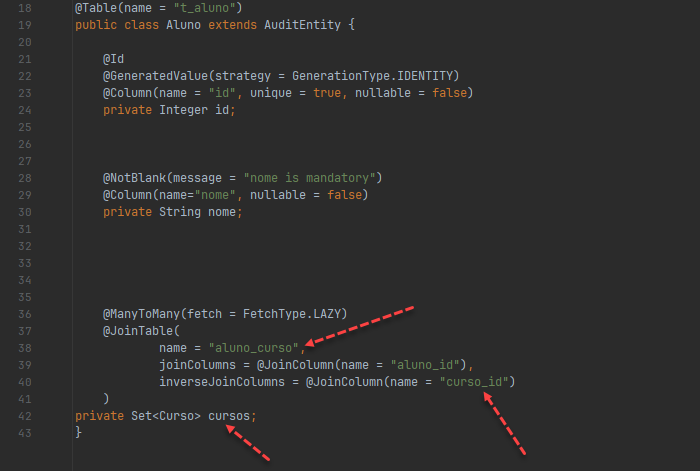

## 5. Remover Relação

> **Importante**: Se tiver cometido um erro ao definir a relação — seja no tipo de cardinalidade (`OneToOne`, `OneToMany`, etc.) ou na entidade relacionada — **remova a relação existente, grave, e crie uma nova com os parâmetros corretos**.

### Opção 1

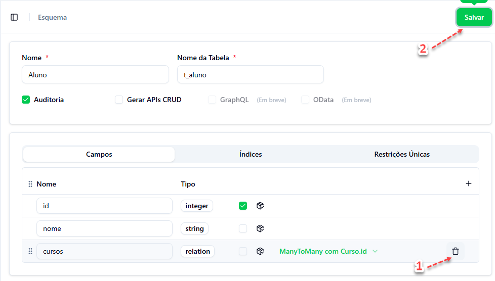

### Opção 2

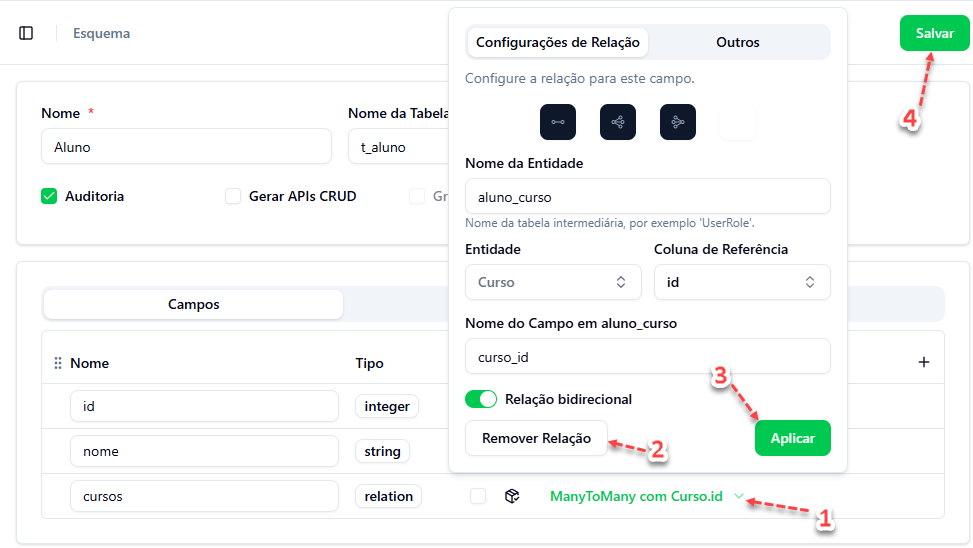
