# Diagrama ER

O Spring Engine permite a criação de relacionamentos entre modelos, embora não haja uma implementação automática para gerar o código desses relacionamentos. Os relacionamentos são configurados manualmente no arquivo de configuração do modelo e, em seguida, o modelo é regenerado para refletir as alterações.

**Tipos de Relacionamentos:** 

- **@OneToOne**: Relacionamento um-para-um.
- **@OneToMany**: Relacionamento um-para-muitos.
- **@ManyToMany**: Relacionamento muitos-para-muitos.

> **Nota**: A relação entre entidades deve ser sempre criada a partir do lado do **proprietário (owner)**, pois é ele quem comanda e define a relação no modelo de dados.

Por este motivo, é fundamental **definir primeiro o lado inverso**, para que o lado proprietário possa referenciá-lo corretamente no momento da criação da relação.

Isto garante que o IGRP Studio reconheça e configure corretamente os mapeamentos no código gerado.


## 1. Relação One-to-One (1:1) 
- Exemplo: Um `país` tem um único `presidente`, e o presidente é responsável por apenas um país.

### 1.1. País – Configuração (lado inverso)

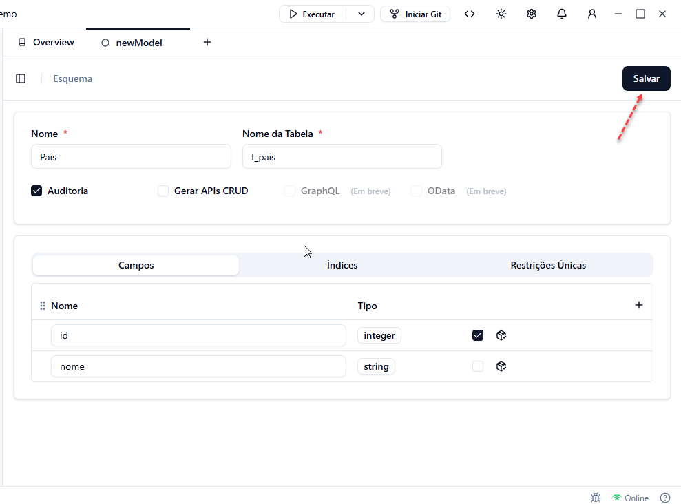

### 1.2. Presidente – Configuração (lado proprietário / owner)

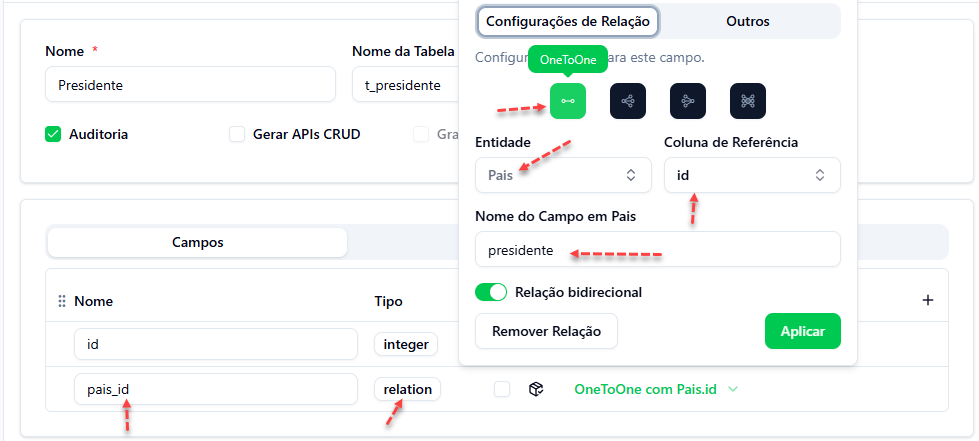

### 1.3. País – Código Gerado (lado inverso)
A anotação `@OneToOne(mappedBy = "paisId")` indica que a entidade `Presidente` possui uma propriedade chamada `paisId` que mapeia esta relação.

```java
@Table(name = "t_pais")
public class Pais extends AuditEntity {

    @Id
    @GeneratedValue(strategy = GenerationType.IDENTITY)
    @Column(name = "id", unique = true, nullable = false)
    private Integer id;

    @NotBlank(message = "nome is mandatory")
    @Column(name = "nome", nullable = false)
    private String nome;

    @OneToOne(mappedBy = "paisId", fetch = FetchType.LAZY)
    private Presidente presidente;
}
```


### 1.4. Presidente – Código Gerado (lado proprietário)
No seguinte relacionamento bidirecional entre as entidades, a entidade `Presidente`, a anotação `@JoinColumn` define que a chave estrangeira `pais_id` referencia o identificador da entidade `Pais (Pais.id)`. Por sua vez, na entidade `Pais`, o atributo presidente está mapeado com o parâmetro `mappedBy = "paisId"`, indicando que a entidade `Presidente` é a responsável por gerir esta relação.

```java
@Table(name = "t_presidente")
public class Presidente extends AuditEntity {

    @Id
    @GeneratedValue(strategy = GenerationType.IDENTITY)
    @Column(name = "id", unique = true, nullable = false)
    private Integer id;

    @NotNull(message = "paisId is mandatory")
    @OneToOne(fetch = FetchType.LAZY)
    @JoinColumn(name = "pais_id", unique = true, referencedColumnName = "id")
    private Pais paisId;
}
```


## 2. Relação One-to-Many (1:N) 
- Exemplo: Um `estado` pode ter várias `cidades`, mas cada cidade pertence a um único estado.

### 2.1. Cidade – Configuração (lado inverso)

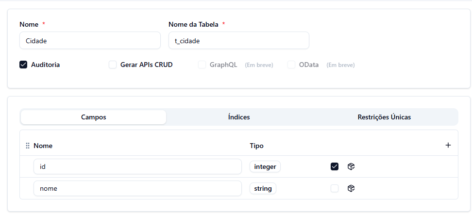

### 2.2. Estado – Configuração (lado proprietário / owner)

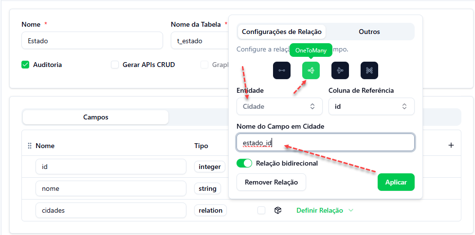
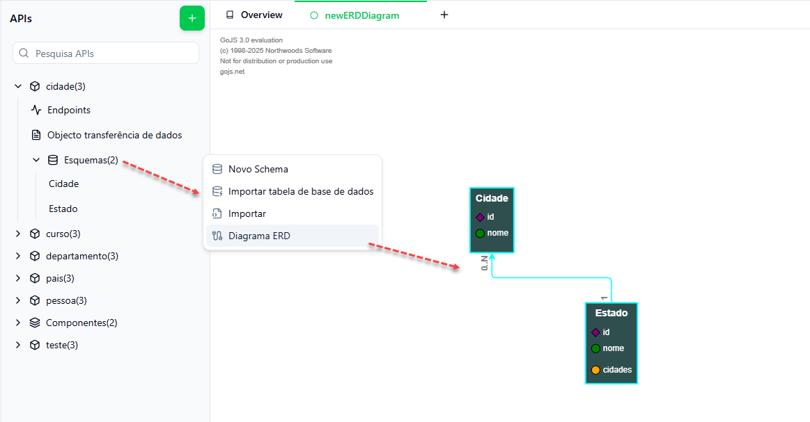


### 2.3. Cidade – Código Gerado (lado inverso)
O relacionamento do tipo `@ManyToOne` indica que cada instância da entidade `Cidade` está associada a uma única instância da entidade `Estado`, por meio de uma chave estrangeira designada como `estado_id`.   

```java
@Table(name = "t_cidade")
public class Cidade extends AuditEntity {

    @Id
    @GeneratedValue(strategy = GenerationType.IDENTITY)
    @Column(name = "id", unique = true, nullable = false)
    private Integer id;

    @NotBlank(message = "nome is mandatory")
    @Column(name = "nome", nullable = false)
    private String nome;

    @ManyToOne(fetch = FetchType.LAZY)
    @JoinColumn(name = "estado_id")
    private Estado estadoId;
}
```

### 2.4. Estado – Código Gerado (lado proprietário)
O relacionamento entre as entidades `Estado` e `Cidade` é modelado de forma bidirecional, utilizando as anotações `@OneToMany` e `@ManyToOne`. A entidade Estado mantém uma lista de objetos do tipo `Cidade`, sendo esse vínculo definido pela propriedade `mappedBy = "estadoId"`, que indica que o lado inverso da relação está na entidade `Cidade`. Por sua vez, a entidade `Cidade` contém uma chave estrangeira denominada `estadoId`, mapeada através da anotação `@JoinColumn(name = "estado_id")`, estabelecendo a associação direta com a entidade `Estado`. Este mapeamento garante a integridade relacional e facilita a navegação em ambas as direções no modelo de dados. 

```java
@Table(name = "t_estado")
public class Estado extends AuditEntity {

    @Id
    @GeneratedValue(strategy = GenerationType.IDENTITY)
    @Column(name = "id", unique = true, nullable = false)
    private Integer id;

    @NotBlank(message = "nome is mandatory")
    @Column(name = "nome", nullable = false)
    private String nome;

    @OneToMany(mappedBy = "estadoId", fetch = FetchType.LAZY)
    private List<Cidade> cidades;
}
```


## 3. Relação Many-to-One (N:1) 
- Exemplo: Vários `funcionários` podem trabalhar no mesmo `departamento`, mas cada funcionário pertence a apenas um departamento.

### 3.1. Departamento – Configuração (lado inverso)

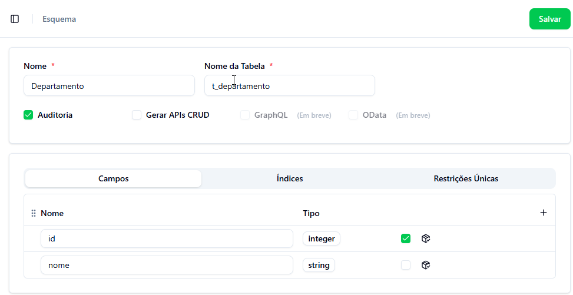

### 3.2. Funcionário – Configuração (lado proprietário / owner)

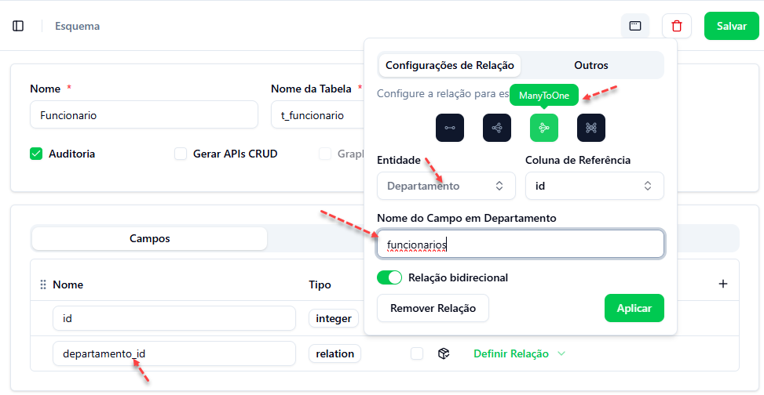

### 3.3. Departamento – Código Gerado (lado inverso)
O relacionamento `@OneToMany` com a entidade `Funcionario` indica que esta entidade representa o lado "um" de uma associação em que um departamento pode estar associado a múltiplos funcionários. Para refletir corretamente esta relação bidirecional, a entidade Funcionario deverá conter a propriedade `departamentoId` anotada com `@ManyToOne`, estabelecendo assim a referência ao departamento correspondente.

```java
@Table(name = "t_departamento")
public class Departamento extends AuditEntity {

    @Id
    @GeneratedValue(strategy = GenerationType.IDENTITY)
    @Column(name = "id", unique = true, nullable = false)
    private Integer id;

    @NotBlank(message = "nome is mandatory")
    @Column(name = "nome", nullable = false)
    private String nome;

    @OneToMany(mappedBy = "departamentoId")
    private List<Funcionario> funcionarios;
}
```

### 3.4. Funcionário – Código Gerado (lado proprietário)
A entidade Funcionario estabelece uma associação do tipo `@ManyToOne` com a entidade `Departamento`, sendo esta representada por uma chave estrangeira designada `departamento_id`. Por sua vez, a entidade `Departamento` mantém uma lista de funcionários através da propriedade `List<Funcionario> funcionarios`, utilizando o atributo `mappedBy = "departamentoId"` para indicar o lado inverso da associação.

```java
@Table(name = "t_funcionario")
public class Funcionario extends AuditEntity {

    @Id
    @GeneratedValue(strategy = GenerationType.IDENTITY)
    @Column(name = "id", unique = true, nullable = false)
    private Integer id;

    @NotNull(message = "departamentoId is mandatory")
    @ManyToOne(fetch = FetchType.LAZY)
    @JoinColumn(name = "departamento_id", referencedColumnName = "id")
    private Departamento departamentoId;
}
```

## 4. Relação Many-to-Many (N:M) 
- Exemplo: Um `aluno` pode inscrever-se em vários `cursos`, e cada curso pode ter vários alunos.

### 4.1. Curso – Configuração (lado inverso)

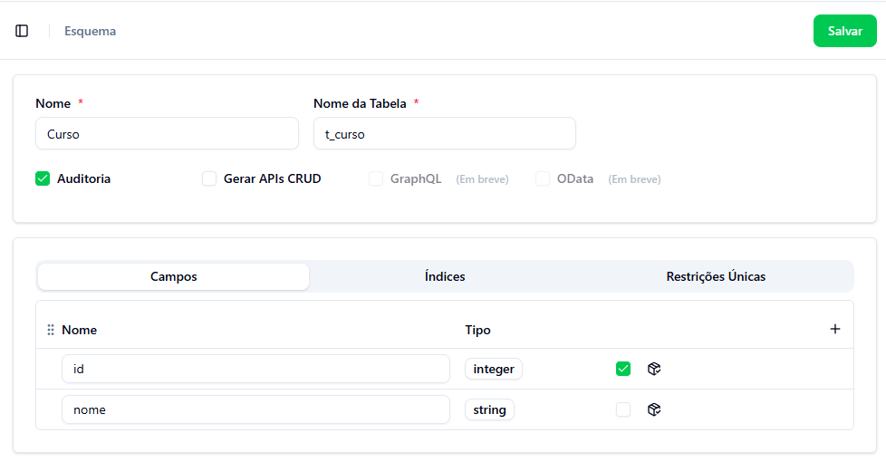

### 4.2. Aluno – Configuração (lado proprietário / owner)

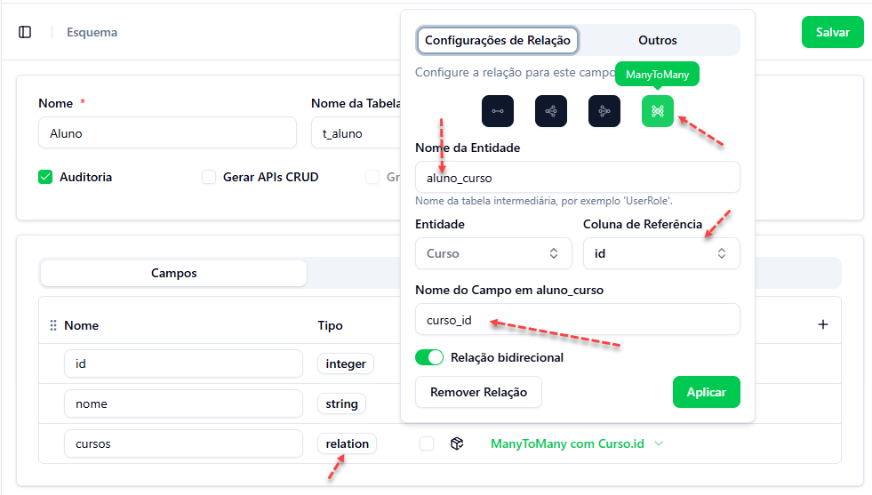

### 4.3. Curso – Código Gerado (lado inverso)
A presente entidade configura o lado inverso do relacionamento, na `classe Aluno`, deverá constar a propriedade cursos, devidamente anotada com `@ManyToMany` e `@JoinTable(...)`.

```java
@Table(name = "t_curso")
public class Curso extends AuditEntity {

    @Id
    @GeneratedValue(strategy = GenerationType.IDENTITY)
    @Column(name = "id", unique = true, nullable = false)
    private Integer id;

    @NotBlank(message = "nome is mandatory")
    @Column(name = "nome", nullable = false)
    private String nome;

    @ManyToMany(mappedBy = "cursos", fetch = FetchType.LAZY)
    private Set<Aluno> alunos;
}
```


### 4.4. Aluno – Código Gerado (lado proprietário)
A seguinte classe representando o lado proprietário da relação, é responsável pela gestão da tabela de junção `aluno_curso`. Por sua vez, a `classe Curso` assume o papel de lado inverso da associação, utilizando o atributo `mappedBy = "cursos"` para indicar que a relação é mapeada pela entidade principal.

```java
@Table(name = "t_aluno")
public class Aluno extends AuditEntity {

    @Id
    @GeneratedValue(strategy = GenerationType.IDENTITY)
    @Column(name = "id", unique = true, nullable = false)
    private Integer id;

    @NotBlank(message = "nome is mandatory")
    @Column(name = "nome", nullable = false)
    private String nome;

    @ManyToMany(fetch = FetchType.LAZY)
    @JoinTable(
        name = "aluno_curso",
        joinColumns = @JoinColumn(name = "aluno_id"),
        inverseJoinColumns = @JoinColumn(name = "curso_id")
    )
    private Set<Curso> cursos;
}
```


## 5. Remover Relação

> **Importante**: Se tiver cometido um erro ao definir a relação — seja no tipo de cardinalidade (`OneToOne`, `OneToMany`, etc.) ou na entidade relacionada — **remova a relação existente, grave, e crie uma nova com os parâmetros corretos**.

### Opção 1

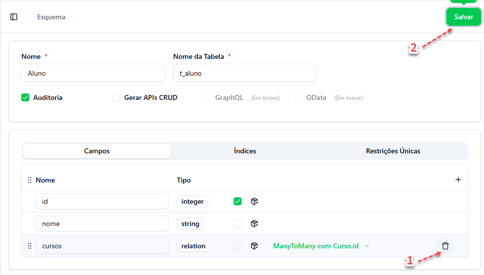

### Opção 2

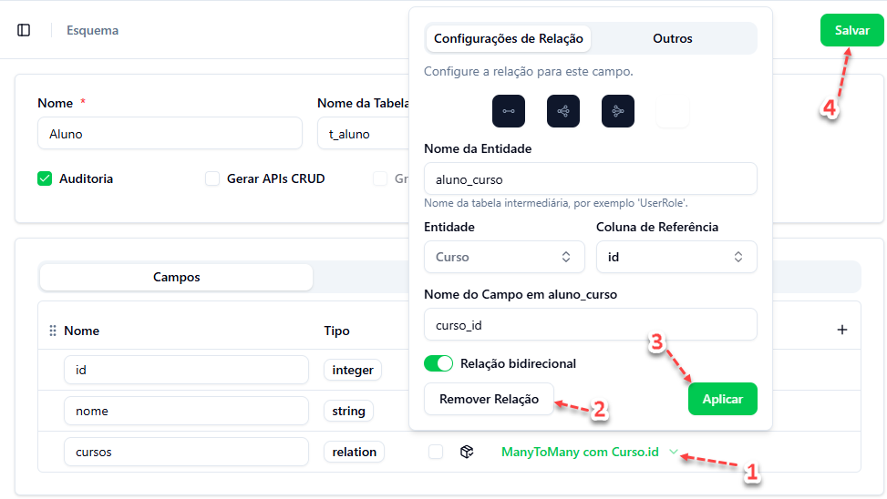
