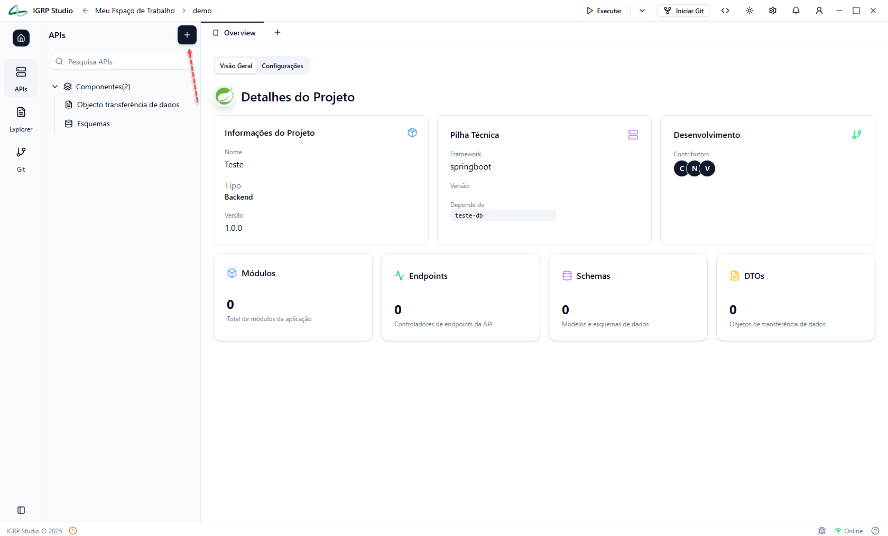
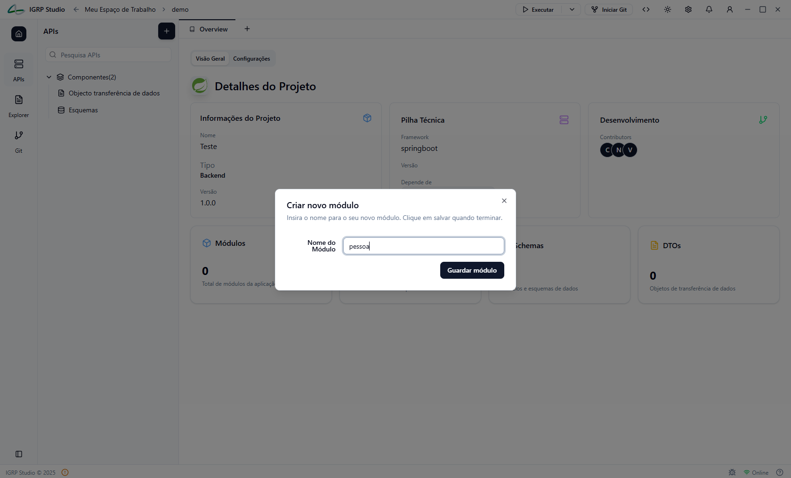
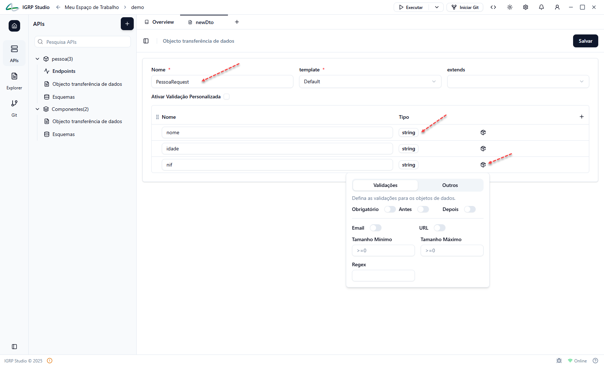
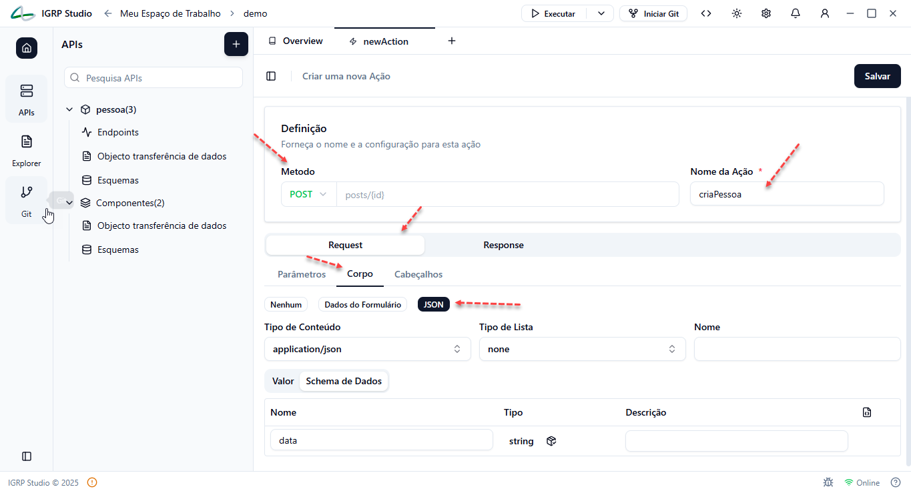
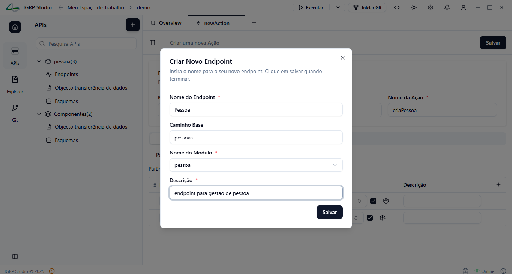
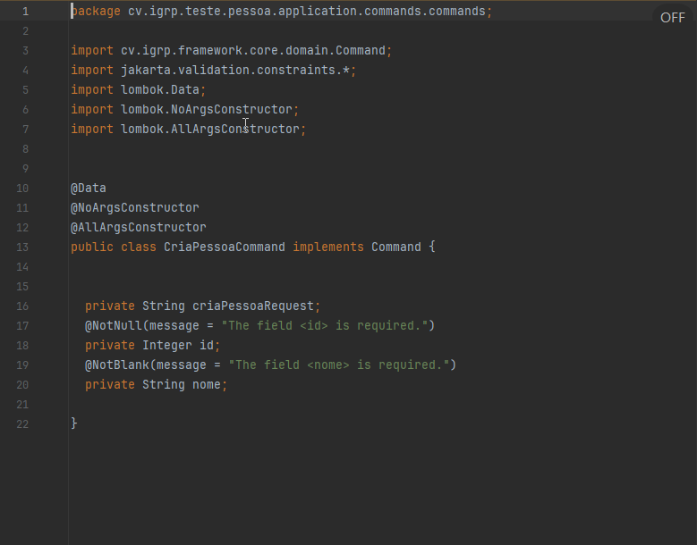
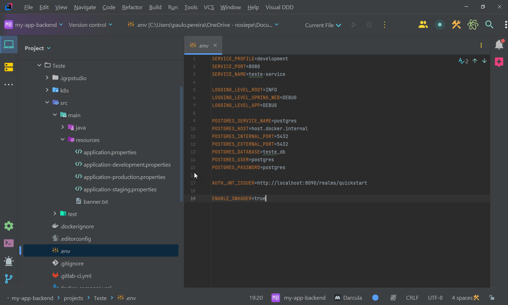
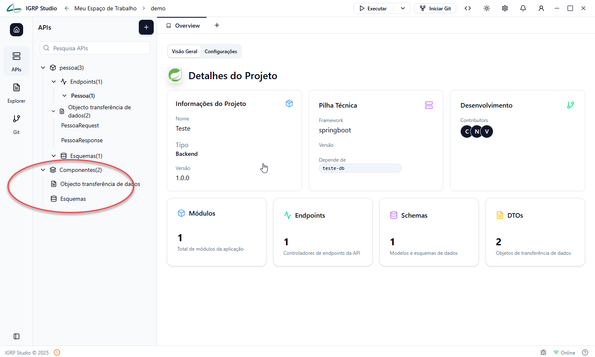
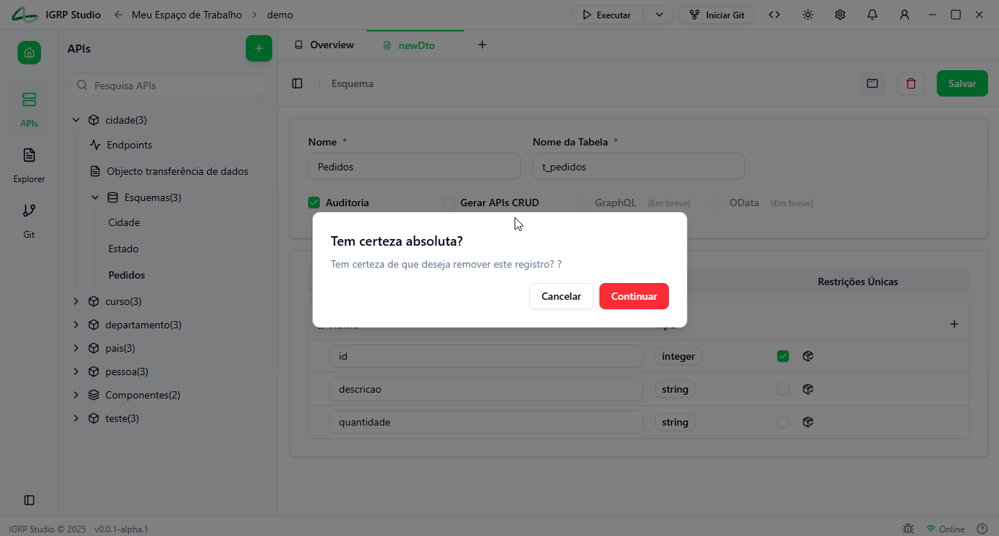

# Designer de Modelos

O Projecto Spring permite a criação e configuração de modelos, CRUDs, controladores e DTOs de forma automatizada. Abaixo, detalhamos cada componente:

## Criação de Módulos

Organize a aplicação em **módulos**, de acordo com os domínios do negócio.

### Para criar um módulo:
1. Clicar em `Novo Módulo`
2. Introduzir o nome (ex: `pessoa`)
3. Guardar o módulo

## Definição de DTOs (Data Transfer Objects)

Crie os **DTOs** responsáveis por transportar dados entre as camadas da aplicação.

  - `idade` (string)
  - `nif` (string)

### Configurar validações:
- `Required`, `Email`, `MinLength`, `MaxLength`, entre outros

## Definição de Endpoints e Ações

Configure os **endpoints REST** e associe as respetivas ações.

### Exemplo:
- Endpoint: `Pessoa`
  - Base path: `/pessoas`
  - Ações:
    - `criarPessoa` (POST)
    - `obterPessoaPorId` (GET)

### Configurações para cada ação:
- Método HTTP (`GET`, `POST`, ...)
- Parâmetros e corpo da requisição
- Tipo de conteúdo: `application/json`
- Esquema de resposta

## Implementação Automática

O IGRP Studio gera automaticamente:

- **Controladores** com base nos endpoints definidos
- Implementações de **Commands e Queries** seguindo o padrão **CQRS**:
  - `Command` para criar pessoa
  - `Query` para obter pessoa
  - Handlers correspondentes

## Modelagem de Entidades

Crie o **modelo de domínio** através de schemas.

### Exemplo: Entidade `Pessoa`
- Campos:
  - `id` (integer, chave primária)
  - `nome` (string)
  - `idade` (string)
  - `nif` (string)
- Configurações:
  - Nome da tabela
  - Auditoria
  - Revisão

O IGRP Studio gera automaticamente:
- Classe da entidade
- Repositórios JPA

## Configuração do Banco de Dados

As configurações da base de dados são definidas em ficheiros de propriedades.

### Ficheiros principais:
- `application-development.properties`
- `.env` com variáveis de ambiente

## Módulo Shared

O projeto inclui um módulo especial: `shared`, criado automaticamente.

### Função:
Contém **código reutilizável**, comum a vários domínios (ex: utilitários, constantes, exceções).

## Eliminar
Descrição: Permite remover qualquer recurso anteriormente criado (endpoint, modelo, DTO, etc.).

> **Importante**: Garantir que não há dependências ativas antes da remoção.

## Considerações Finais
A estrutura criada pelo IGRP Studio respeita os princípios de:
- **Domain-Driven Design (DDD)**
- **Clean Architecture**
- **Separação de responsabilidades**
- **Automação com boas práticas**