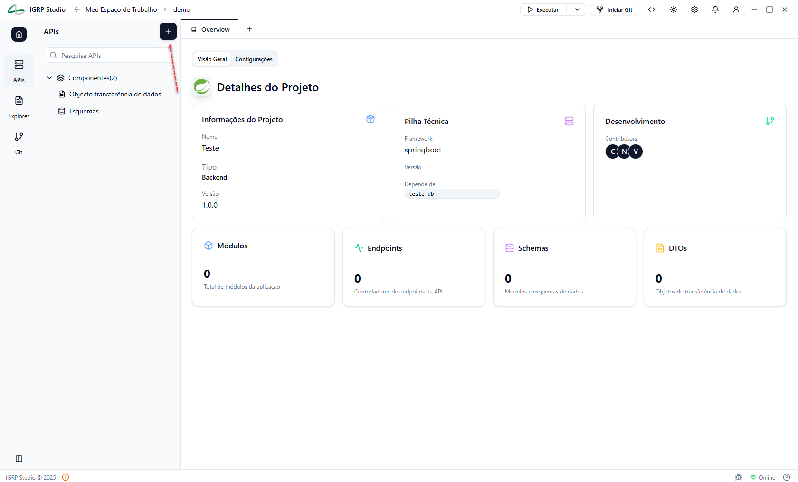
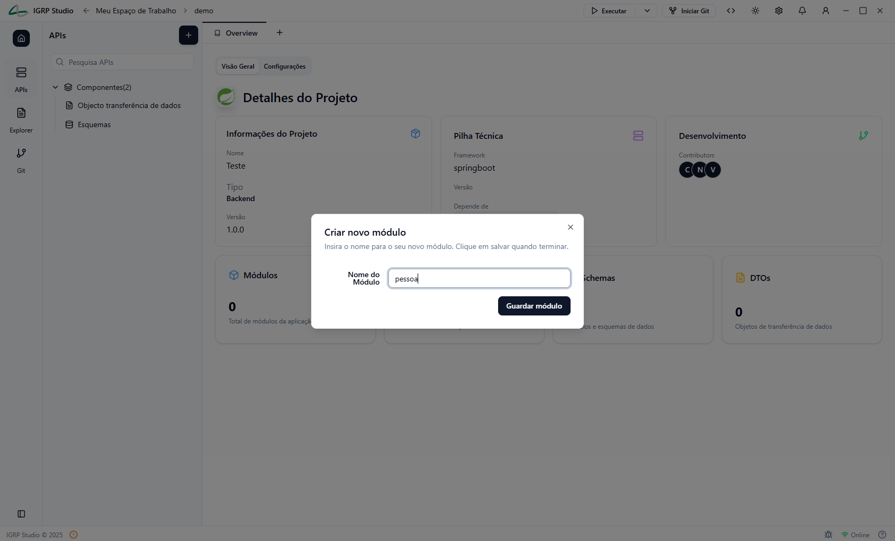
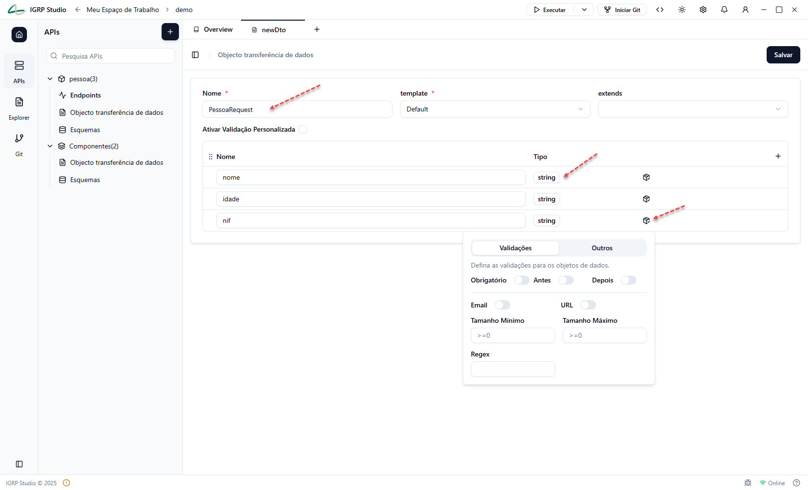
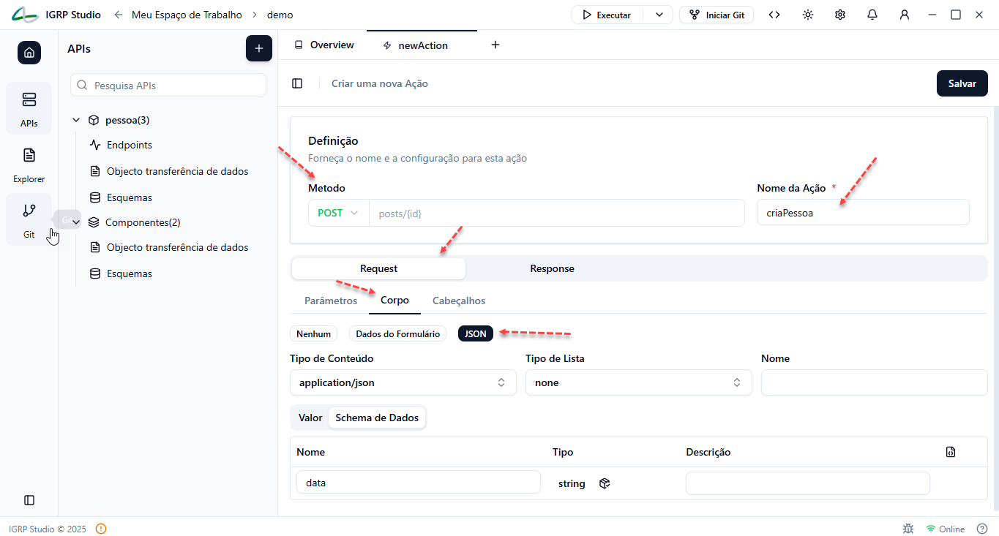
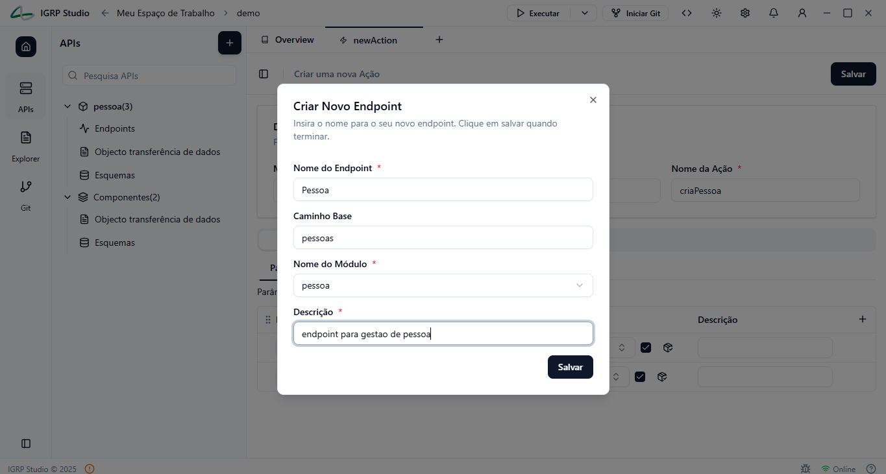
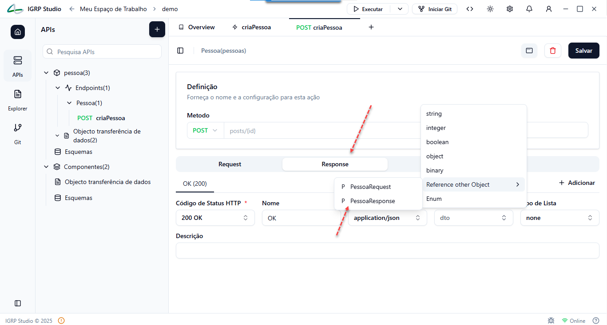
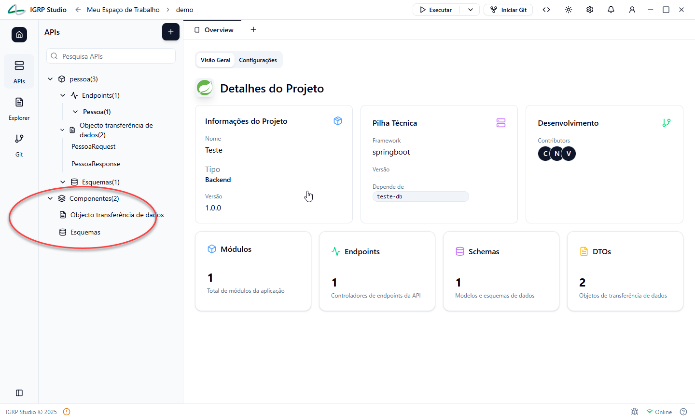
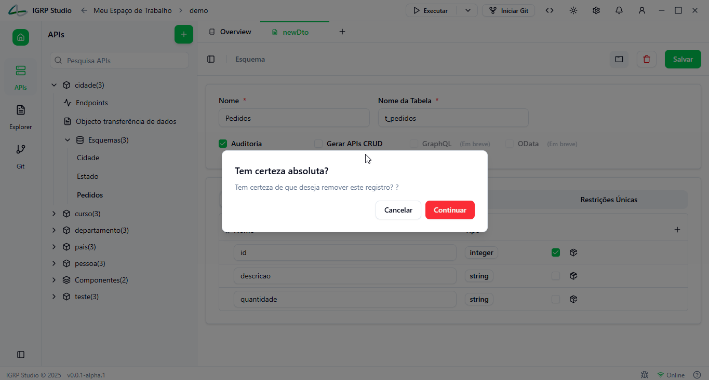

# Designer de Modelos

O Projecto Spring permite a criação e configuração de modelos, CRUDs, controladores e DTOs de forma automatizada. Abaixo, detalhamos cada componente:


## Criação de Módulos

Organize a aplicação em **módulos**, de acordo com os domínios do negócio.



### Para criar um módulo:
1. Clicar em `Novo Módulo`
2. Introduzir o nome (ex: `pessoa`)
3. Guardar o módulo



## Definição de DTOs (Data Transfer Objects)

Crie os **DTOs** responsáveis por transportar dados entre as camadas da aplicação.

  - `idade` (string)
  - `nif` (string)




### Configurar validações:
- `Required`, `Email`, `MinLength`, `MaxLength`, entre outros




## Definição de Endpoints e Ações

Configure os **endpoints REST** e associe as respetivas ações.

### Exemplo:
- Endpoint: `Pessoa`
  - Base path: `/pessoas`
  - Ações:
    - `criarPessoa` (POST)
    - `obterPessoaPorId` (GET)




### Configurações para cada ação:
- Método HTTP (`GET`, `POST`, ...)
- Parâmetros e corpo da requisição
- Tipo de conteúdo: `application/json`
- Esquema de resposta




## Implementação Automática

O IGRP Studio gera automaticamente:

- **Controladores** com base nos endpoints definidos
- Implementações de **Commands e Queries** seguindo o padrão **CQRS**:
  - `Command` para criar pessoa
  - `Query` para obter pessoa
  - Handlers correspondentes


```java
public class PessoaController {

    private static final Logger LOGGER = LoggerFactory.getLogger(PessoaController.class);

    private final CommandBus commandBus;
    private final QueryBus queryBus;

    public PessoaController(
        CommandBus commandBus, QueryBus queryBus
    ) {
        this.commandBus = commandBus;
        this.queryBus = queryBus;
    }

    @PostMapping
    @Operation(
        summary = "POST method to handle operations for criaPessoa",
        description = "POST method to handle operations for criaPessoa",
        responses = {
            @ApiResponse(
                responseCode = "200",
                description = "",
                content = @Content(
                    mediaType = "application/json",
                    schema = @Schema(,
                    implementation = DTO.class,
                    type = "")
                )
            )
        }
    )

    public ResponseEntity<Dto> criaPessoa(
    @RequestBody String criaPessoaRequest,
    @RequestParam(value = "id") Integer id,
    @RequestParam(value = "nome") String nome
) {
    LOGGER.debug("Operation started - Endpoint: {}, Action: {}", "PessoaController", "criaPessoa");
    
    final var command = new CriaPessoaCommand(criaPessoaRequest, id, nome);
    ResponseEntity<Dto> response = commandBus.send(command);
    
    LOGGER.debug("Operation finished - Endpoint: {}, Action: {}", "PessoaController", "criaPessoa");
    
    return ResponseEntity.status(response.getStatusCode())
                         .headers(response.getHeaders())
                         .body(response.getBody());
}
```


## Modelagem de Entidades

Crie o **modelo de domínio** através de schemas.
O IGRP Studio gera automaticamente:
- Classe da entidade
- Repositórios JPA


```java
import cv.igrp.framework.core.domain.Command;
import jakarta.validation.constraints.*;
import lombok.Data;
import lombok.NoArgsConstructor;
import lombok.AllArgsConstructor;

@Data
@NoArgsConstructor
@AllArgsConstructor
public class CriaPessoaCommand implements Command {

    private String criaPessoaRequest;

    @NotNull(message = "The field <id> is required.")
    private Integer id;

    @NotBlank(message = "The field <nome> is required.")
    private String nome;
}
```


## Configuração do Banco de Dados

As configurações da base de dados são definidas em ficheiros de propriedades.

### Ficheiros principais:
- `application-development.properties`
- `.env` com variáveis de ambiente

# Variáveis de Ambiente (.env)

```.env
SERVICE_PROFILE=development
SERVICE_PORT=8080
SERVICE_NAME=teste-service

LOGGING_LEVEL_ROOT=INFO
LOGGING_LEVEL_SPRING_WEB=DEBUG
LOGGING_LEVEL_APP=DEBUG

POSTGRES_SERVICE_NAME=postgres
POSTGRES_HOST=host.docker.internal
POSTGRES_INTERNAL_PORT=5432
POSTGRES_EXTERNAL_PORT=5432
POSTGRES_DATABASE=teste_db
POSTGRES_USER=postgres
POSTGRES_PASSWORD=postgres

AUTH_JWT_ISSUER=http://localhost:8090/realms/quickstart

ENABLE_SWAGGER=true
```


## Módulo Shared

O projeto inclui um módulo especial: `shared`, criado automaticamente.

### Função:
Contém **código reutilizável**, comum a vários domínios (ex: utilitários, constantes, exceções).



## Eliminar
Descrição: Permite remover qualquer recurso anteriormente criado (endpoint, modelo, DTO, etc.).

> **Importante**: Garantir que não há dependências ativas antes da remoção.




## Considerações Finais
A estrutura criada pelo IGRP Studio respeita os princípios de:
- **Domain-Driven Design (DDD)**
- **Clean Architecture**
- **Separação de responsabilidades**
- **Automação com boas práticas**