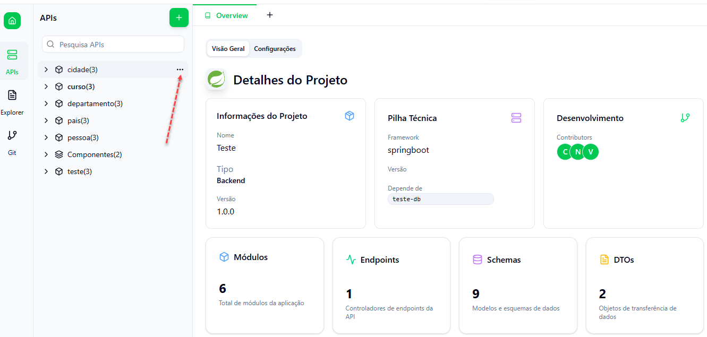
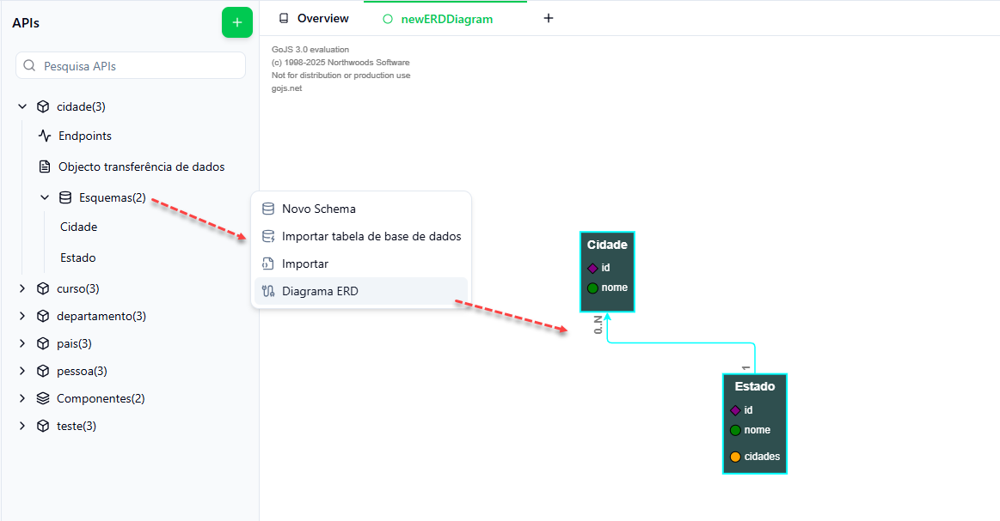

# Designer de Modelos

O Projecto Spring permite a criação e configuração de modelos, CRUDs, controladores e DTOs de forma automatizada. Abaixo, detalhamos cada componente:





## Novo Endpoint

- **Descrição**: Cria controladores REST (`@RestController`) com métodos associados a rotas HTTP.
- **Internamente**: Gera ficheiros no módulo `Controlador`, usando `generateController.ts`.
- **Parâmetros**: Caminho do endpoint, tipo de resposta, variáveis, `requestBody`, `requestParams`, etc.
- **Spring Boot**: Usa `@GetMapping`, `@PostMapping`, etc., com retorno de DTOs.
- **Nota Técnica**: A interface de serviço é também gerada e os métodos devem ser posteriormente implementados.


## Novo DTO (Data Transfer Object)

Os **DTOs** são gerados para transferir dados entre as camadas da aplicação. Eles são criados com base nos modelos e podem ser personalizados para incluir apenas os atributos necessários.

**Funcionalidades:**
- **Geração de DTOs**: Os DTOs são gerados automaticamente com base nos modelos, permitindo a transferência de dados de forma segura e eficiente.
- **Personalização**: Os DTOs podem ser configurados para incluir ou excluir atributos específicos.


## Novo Schema

- **Descrição**: Define a estrutura dos dados persistentes da aplicação (modelo de domínio).
- **Internamente**: Gera ficheiros Java com classes `@Entity`, associadas a `JpaRepository`.
- **Processo**: Utiliza `modelResourceGenerator()` com `templateGenerator()` para criar os modelos.
- **Relações Suportadas**: `@OneToOne`, `@OneToMany`, `@ManyToMany`, definidas no ficheiro de configuração do modelo.




## Api CRUDs

O **Spring Engine** permite a geração automática de operações CRUD (**Create, Read, Update, Delete**) para os modelos. O CRUD é gerado como um repositório que estende a interface `CrudRepository` do **Spring Data JPA**.


## Novo Enum

- **Descrição**: Tipo especial que define conjuntos de valores constantes.
- **Exemplo de uso**: Campos como `StatusPedido {PENDENTE, CONFIRMADO, CANCELADO}`.
- **Spring Boot**: Usado em campos de entidade com `@Enumerated(EnumType.STRING)`.


## Nova Resposta

- **Descrição**: Define a estrutura de dados padrão de retorno dos endpoints.
- **Padrão recomendado**:
```java
public class ApiResponse<T> {
    private String mensagem;
    private T dados;
}
```

## Eliminar
Descrição: Permite remover qualquer recurso anteriormente criado (endpoint, modelo, DTO, etc.).

> **Importante**: Garantir que não há dependências ativas antes da remoção.


