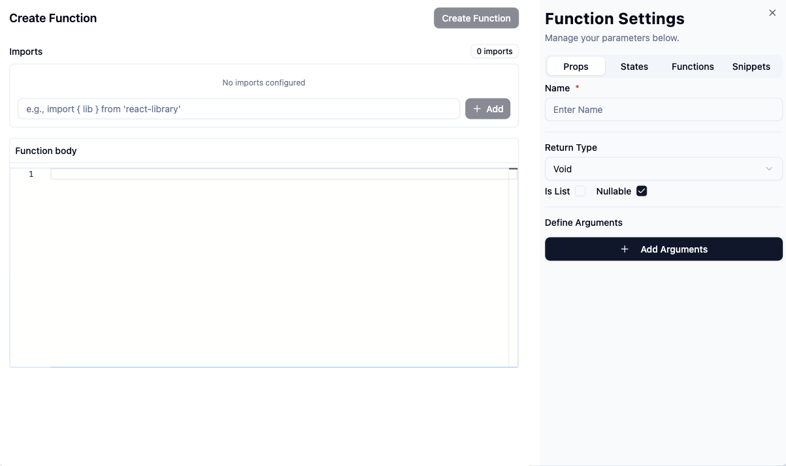
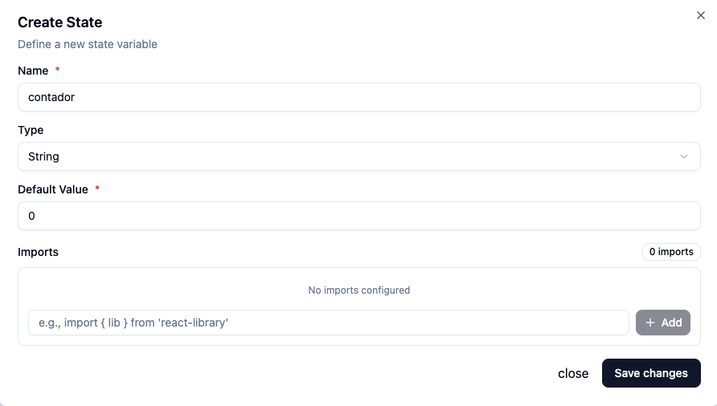

# Custom Code

A seção **Custom Code** permite adicionar lógica personalizada ao seu projeto utilizando funções reutilizáveis e estados internos **States**. Essa funcionalidade é útil para encapsular lógica de negócio, processar dados ou reagir a eventos do utiliador de forma controlada e organizada.

## 📌 Visão Geral

A interface permite:

- Criar **Funções** com argumentos, tipos de retorno, e dependências externas.
- Criar e gerenciar **Estados** (**States**) reutilizáveis para controle reativo de dados.
- Organizar e reaproveitar **Snippets** de código.

## 🔧 Criar uma Função

Na Navegação `Custom Code`, ao clicar em `+` `Dropdown` e selecionar `Function`, será exibida uma interface de criação de função com as seguintes opções:

### 🧩 Configurações da Função

- **Imports**: adicione bibliotecas externas usando a sintaxe `import`.
- **Function Body**: corpo da função onde o código é inserido.
- **Function Settings**:
  - `Name`: nome da função.
  - `Return Type`: tipo de retorno (`Void`, `String`, `Number`, etc).
  - `Is List` / `Nullable`: define se o retorno é uma lista e se permite `null`.
  - `Arguments`: adicione argumentos com nome, tipo e valor por defeito.


### Exemplo:

```tsx
function getStatusBadge(status: string): string {
  if (status === 'active') return '✅ Ativo';
  if (status === 'inactive') return '❌ Inativo';
  return 'ℹ️ Desconhecido';
}
```

Ao criar uma function pode reulizar outras `functions`, `states` or `snippets code`, basta faze o click na `Insert code` no item dentro dentro do respetivos tab.



---

## 🧠 Estados Reativos (States)

Os **estados** funcionam como variáveis reativas que armazenam e controlam valores da interface. Eles podem ser atualizados em tempo real com base em interações do usuário.

### 📌 Exemplo de state:
```js
const [contador, setContador] = useState(0);
```



## ⚡ Eventos Suportados

Você pode associar funções personalizadas a eventos comuns da interface para controlar comportamentos e fluxos da aplicação de forma reativa.

### Eventos disponíveis (Interactions):

- **`onClick`** – Disparado ao clicar em um botão ou elemento interativo. Ideal para ações como navegação, submissão, ou chamadas de API.

- **`onChange`** – Disparado quando o valor de um campo de input é alterado.Útil para validação dinâmica, atualização de estados ou filtragem de dados.

- **`onLoad`** – Executado ao carregar um componente ou página. Comumente usado para carregar dados iniciais ou configurar o estado da interface.

- **`onSubmit`** – Chamado ao submeter um formulário. Excelente para validação de campos e envio de dados para o backend.

---

## Usage Notes
    - Todos os **Custom Code** aqui criada fica dentro da pagina a editar

---
## ⚙️ Registro de Configuração – `igrp.studio.ts`

> 📌 **Importante**: Toda a configuração descrita abaixo é feita no arquivo  
> **`igrp.studio.ts`**

Este arquivo atua como ponto central para registrar elementos personalizados organizados por contexto da interface, em caso do developer nāo queria utilizar a funcionalidade de registo de function dentro da pagina pode registo globalmente para toda a aplicação,

Ele permite registrar:

- **Tipos (`types`)**: Interfaces ou aliases do TypeScript para modelos de dados estruturados.
- **Ações (`actions`)**: Lógicas executáveis para operações.
- **Funções (`functions`)**: Lógicas reutilizáveis específicas da aplicação.

---

### 📘 Regras de Registro

1. Todas as entradas devem ser arrays de caminhos importáveis (sem extensão).
2. Os caminhos são relativos ao diretório `src/app/(myapp)`.
3. As categorias são opcionais, mas cada uma deve conter pelo menos uma entrada válida.

---

### ✅ Exemplos Válidos

```ts
{
  types: ['types/User'],
  actions: ['server/actions/saveUser'],
  functions: ['client/forms/useUserForm']
}


