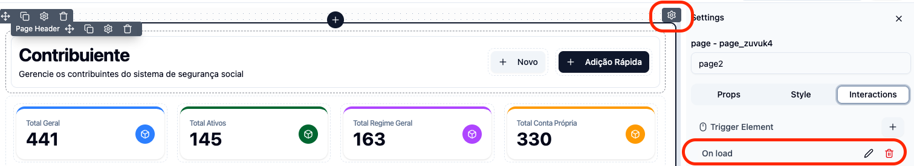
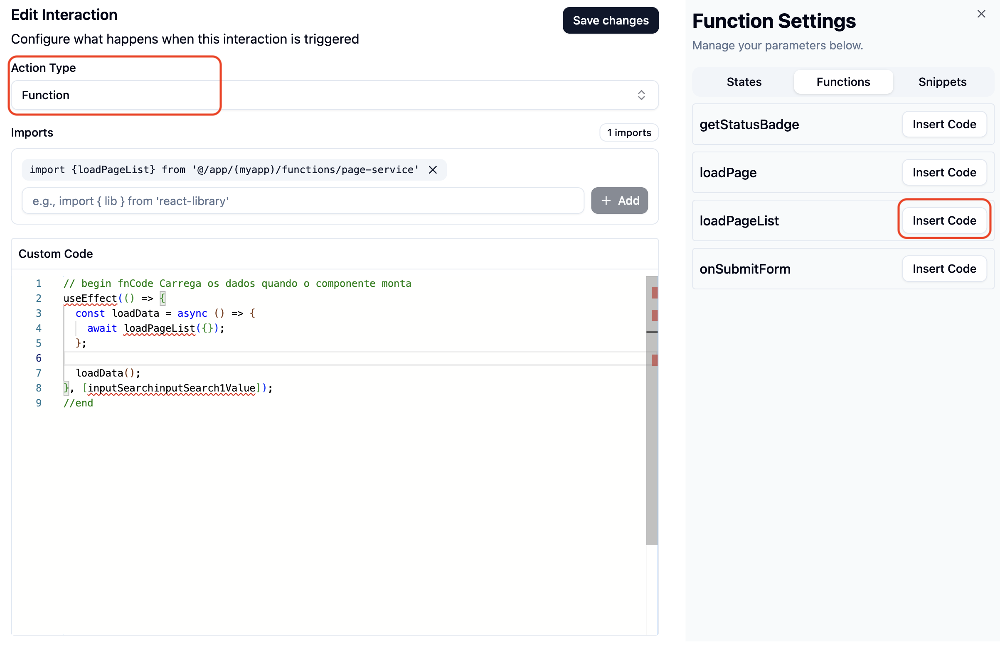

# drag-and-drop

Os componentes utilizados no `igrp studio` permitem a construção visual de interfaces dinâmicas e funcionais. Eles possuem suporte a ações como **adicionar**, **editar**, **clonar**, **remover** e **mover**, além de configuração de **bindings** para integração lógica entre inputs e tabelas.

### 🔁 Ações Disponíveis nos Componentes

Cada componente da interface pode ser:

- 📝 **Editado** → Abre um _sidebar_ com abas de propriedades.
- ❌ **Removido**
- 📋 **Clonado**
- 🔀 **Movido** por _drag & drop_ entre diferentes componentes.

### ⚙️ Sidebar de Edição

Ao editar um componente, uma **sidebar lateral** é aberta com **três abas principais**:

1. **Props** – Propriedades específicas do componente
2. **Styles** – Configurações visuais (margens, fontes, cores etc.)
3. **Interaction** – Eventos e interações (_onClick_, _onChange_, etc.)

### 📥 Binding de Componentes

_Bindings_ permitem a criacao da interface `ts` do _component_. A tabela seguinte resume os seus recursos:

| Tipo de Componente | Binding Disponível | Finalidade                                                                           |
| ------------------ | ------------------ | ------------------------------------------------------------------------------------ |
| `form e table`     | `Binding Config`   | Liga os campos de entrada com a lógica                                               |
| `table`            | `Binding Filter`   | Liga os campos da tabela com os filtros, utilizados quando tem filters `client side` |

> 📌 O **binding** é essencial para que os devlopers possam conchecer a entrada dados da tabela ou formulário.

### ➕ Adição de Componentes (Dropzones)

#### Dentro de Formulários, containar, section, etc

- Os componentes podem ser adicionados diretamente por _drag & drop_.

#### Dentro de Tabelas (`table`)

- Permite adicionar componentes a partir da tabela.
- O botão `Add Component` é exibido sobre a tabela, abrindo uma **popover** para seleção.
- Caso for adicionado um `Actions Column` é exibido sobre a columna um `Add Component`, abrindo uma **modal** para adicianr diversos components suportados.

### 📦 Tipos de Componentes Disponíveis para Drop

- Form Elements (`Text`, `Number`, `Date`, `Checkbox`,`Radio`)
- Basic Elements (`Dropdown`, `Separator`, `Card`,`Charts`)
- Structure (`Flex`, `Grid`, `Fragment`,`Container`)

### 🧪 Exemplo Visual – Fluxo de drag-and-drop

```mermaid
flowchart LR
    A[Utilizador drag-and-drop o componnet do  "Widget palete"]
    B[Por defeito é criado com dois children (table columns, table filters)]
    C[Ao fazer o hover um popover é exibida com tipos de componentes]
    D[Utilizador seleciona um componente]
    E[Componente é adicionado na estrutura visual]
     F[Utilizador edita via Sidebar (Props, Styles, Interaction)]

    A --> B --> C --> D --> E --> F
```

## ⚡ Interações

Você pode associar diversas ações — como `Function`, `Navigation` ou `Form Submit` — a eventos comuns da interface para controlar de forma reativa os comportamentos e fluxos da aplicação.

### 🔄 Principais Eventos

- **`onLoad`** – Executado automaticamente ao carregar um componente ou página.  
  Ideal para inicializar dados, configurar o estado da interface ou preencher dinamicamente elementos como formulários, tabelas e comboboxes.

- **`onClick`** – Disparado ao clicar em botões ou outros elementos interativos.  
  Perfeito para navegação entre páginas, execução de funções customizadas ou chamadas a APIs.

- **`onChange`** – Acionado sempre que o valor de um campo de input for alterado.  
  Útil para validar entradas em tempo real, atualizar estados ou aplicar filtros dinâmicos.

- **`onSubmit`** – Executado ao submeter um formulário.  
  Utilizado para validação final dos campos e envio de dados ao backend.



## 🧩 Ações Suportadas

### 🔧 Function

Permite associar uma **função personalizada** a um evento da interface, como `onClick`, `onChange`, `onLoad`, entre outros.

Por exemplo, ao clicar em um botão com o evento `onClick`, você pode disparar uma função previamente definida em:

O usuário pode optar por diferentes tipos de funções, dependendo das opções oferecidas pelo engine:

- **Function Registrada**: Seleciona uma função previamente declarada e registrada no sistema.
- **Inline Function**: Permite escrever a função diretamente e receber argumentos como o retorno do clique. Ao clicar na aba "Function", o sistema pode importar automaticamente as dependências.

```ts
(event) => myClickHandler(event);
```

or

```ts
myClickHandler;
```

- **Custom Code**: Código personalizado que define lógica específica para o evento.

> ⚠️ As opções disponíveis podem variar de acordo com o suporte do engine em uso no projeto.

### 🔀 Navigation

Permite redirecionar o Utilizador para outra página:

1. Selecione um evento como **`onClick`**.
2. Escolha o **Action Type** como `Navigation`.
3. Defina a página de destino desejada.

### 📤 Form Submit

Permite submeter um formulário com dados preenchidos:

1. Selecione o evento **`onSubmit`** em um componente como botōes.
2. Escolha o **Action Type** como `Form Submit`.
3. Defina qual formulário será submetido.

### Exemplo 
Aqui temos um exemplo de um `custom code` a executar no evento onLoad da pagina, e com imports.




> ⚙️ A associação de eventos e ações permite criar interfaces dinâmicas, reativas e centradas no utilizador, facilitando a construção de aplicações modernas com comportamento inteligente.
