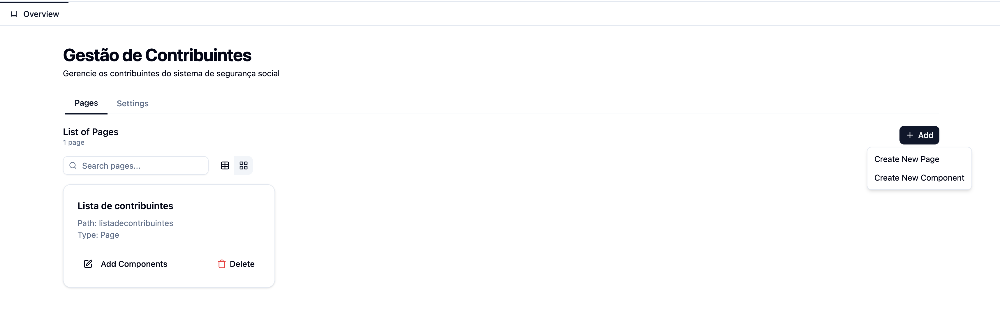
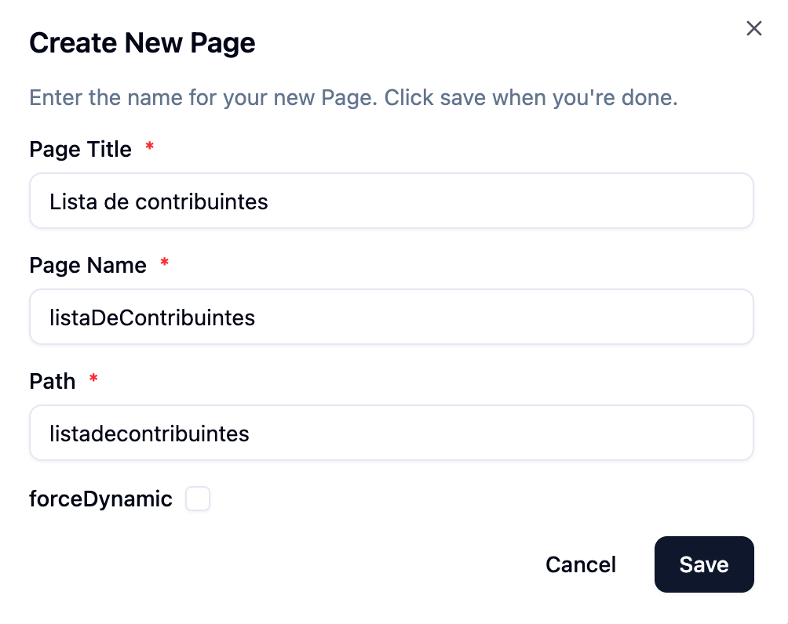

# Gestāo de Páginas

## Visão Geral

Interface central para gerenciamento de todas as páginas do projeto, permitindo criação, edição e organização.

## Funcionalidades

### 📄 Criar Página

1. Clique em **"Criar Nova Página"**
2. Preencha o modal:
   - **Page Title** (obrigatório)
   - **Page Name** (obrigatório)
   - **Path** (obrigatório, URL amigável)
   - **ForceDynamic**
3. Confirme com **"Save"**

### 📄 Adição de Componentes

Ao editar uma página, você pode:

1. Adicionar novos componentes através do menu de componentes

2. Arrastar e soltar componentes para reorganizá-los

3. Configurar cada componente individualmente

4. **"Save"** para publicar a pagina

### 📄 Eliminar a Pagina

Ao fazer o click na opcao **"Delete"**, essa sera removida da aplicaçāo
