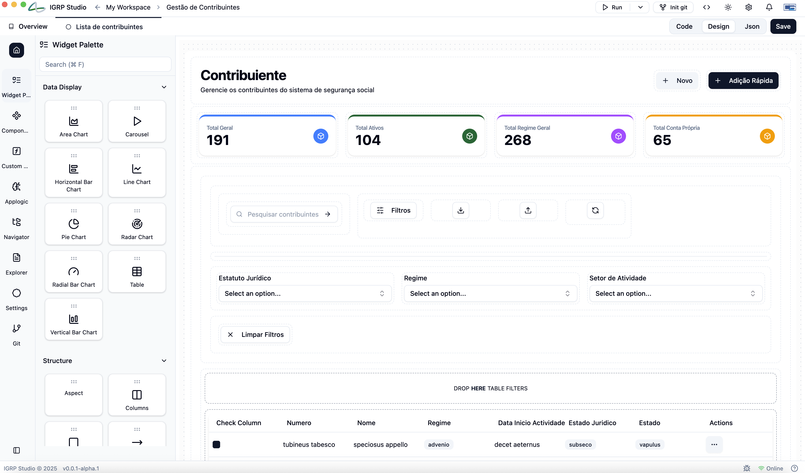

# Page Builder

Esta página representa o **page builder** com suporte a **drag-and-drop** dentro de uma plataforma _low-code_, facilitando a criação de paginas e interfaces dinâmicas.

## 🧭 Visão Geral da Interface

### 📌 Barra Lateral de Navegação

A barra lateral à esquerda oferece acesso aos principais módulos da aplicação:

- **Home** – Voltar ao painel principal.
- **Widget Palette** – Acesso aos componentes visuais.
- **Components** – Componentes personalizados reutilizáveis.
- **Custom code** – adicionar lógica personalizada ao seu projeto.
- **Navigator** (navegação hierárquica de componentes), **Explorer** (todos os ficheiro da aplicaçāo gerada), **Settings** (configurações da aplicaçāo) e **Git** (integração de versionamento)

### 🧩 Widget Palette (Painel de Componentes)

Agrupa os componentes em categorias, como:

#### **Data Display (Exibição de Dados)**

- Area Chart
- Bar Charts (Horizontal, Vertical)
- Pie Chart
- Line Chart
- Radar Chart
- Radial Bar Chart
- Table
- Carousel

#### **Structure (Estrutura de Layout)**

- Aspect
- Columns
- etc

#### **Form Elements**

- Checkbox
- Combobox
- Icon
- Color
- Date Picker
- Number
- Inpuit Text
- etc

Possui também um campo de **busca** rápida (`Search ⌘F`) para localizar components.

## Development Components

### 🎯 Área de Design (Canvas)
  Nessa região, o utilizador pode **drag-and-drop** os componentes disponíveis para construir sua interface.

- Botões para alternar entre:
  - **Code** (Visualizar código)
  - **Design** (Modo Designer)
  - **JSON** (Estrutura em JSON)
- Botão **Save** para publicar alterações