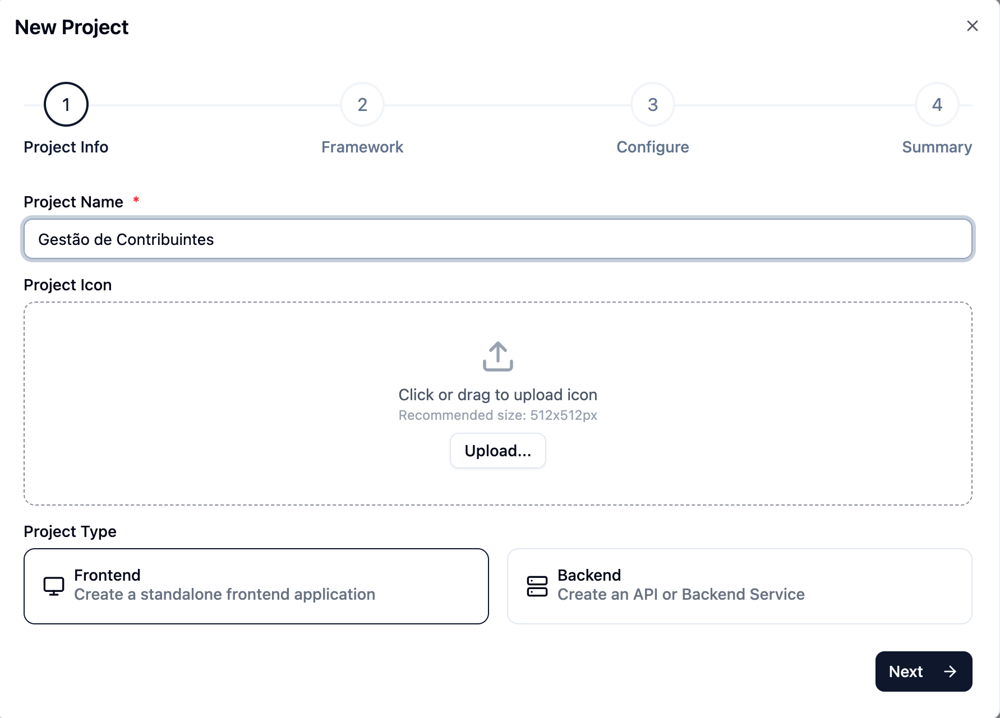
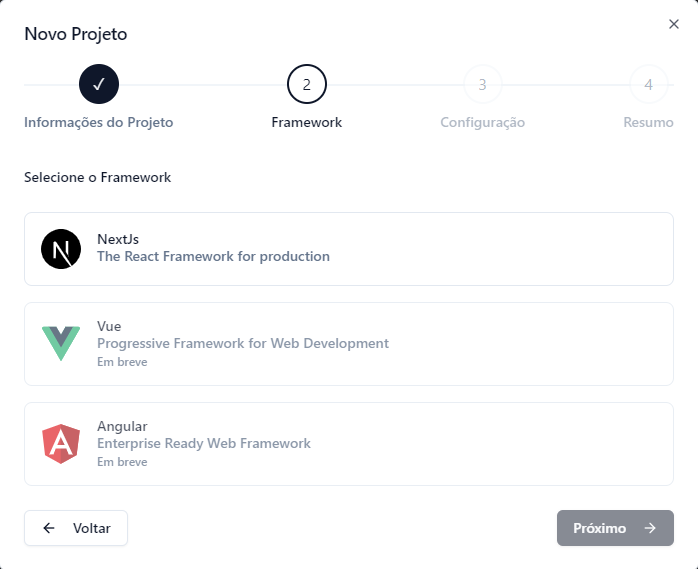
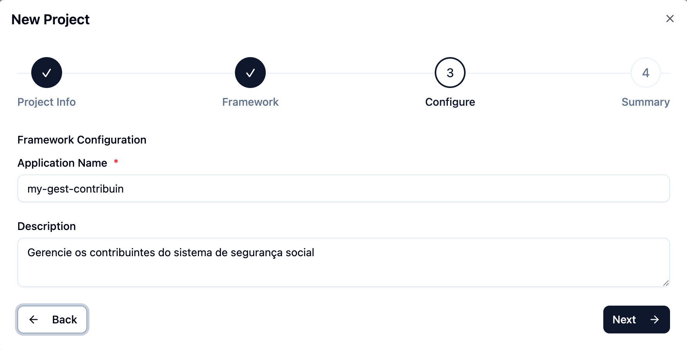
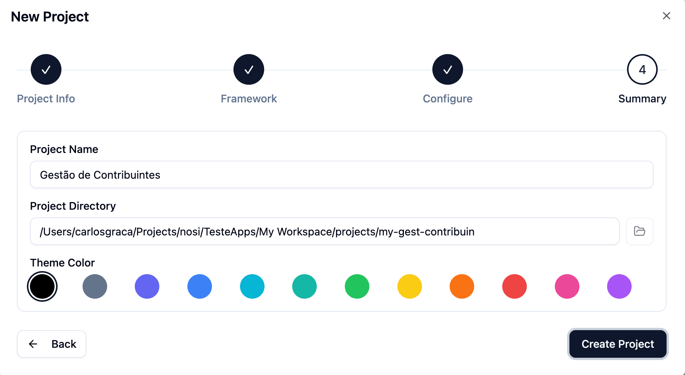

# Projectos

Para criação de um projecto FrontEnd ou BackEnd, há uma sequência de interfaces que orienta o utilizador ao longo de um processo estruturado e intuitivo para a criação de um novo projeto, assegurando que todas as informações necessárias sejam recolhidas e configuradas de forma adequada. Abaixo, apresenta-se uma descrição detalhada de cada uma das interfaces:

## Informações do Projeto

  

- A interface Informações do Projeto é o ponto de início para a criação de um novo projeto. Solicita informações essenciais, como o nome do projeto.

- Inclui uma seção para o envio do ícone do projeto, com as recomendações de tamanho.

- O utilizador deve escolher o tipo de projeto, tendo a opção entre **FrontEnd** (para criar uma aplicação FrontEnd independente) ou **BackEnd** (para criar uma API ou Serviço BackEnd).

- A interface disponibiliza um botão **Próximo** para prosseguir para próximo passo.

## Seleção do Framework

  

Na interface de Seleção do Framework, o utilizador deve selecionar o framework que será utilizado no projeto de acordo com as opções disponíveis:

- **NexJS**: Framework React para SSR, focado em performance e SEO.
- **Vue**: Framework JavaScript leve e progressivo para UIs interativas **(Disponível em breve)**.
- **Angular**: Framework TypeScript completo para aplicações escaláveis e estruturadas **(Disponível em breve)**.

A interface oferece botões **Voltar** e **Próximo** para navegar entre os passos.

## Configuração do Framework

  

- Após a seleção do framework, a interface de Configuração do Framework permite configurar detalhes específicos do projeto, como nome e a descrição.

- A interface inclui botões **Voltar** e **Próximo** para continuar o processo de configuração.

## Resumo do Projeto

  

- A interface final, Resumo do Projeto, apresenta um resumo das informações do projeto antes da sua criação. É especificado o nome e o diretório do projeto.

- A interface oferece a opção de retornar aos **passos anteriores** ou finalizar a criação do projeto através do botão **Criar Projeto**.
