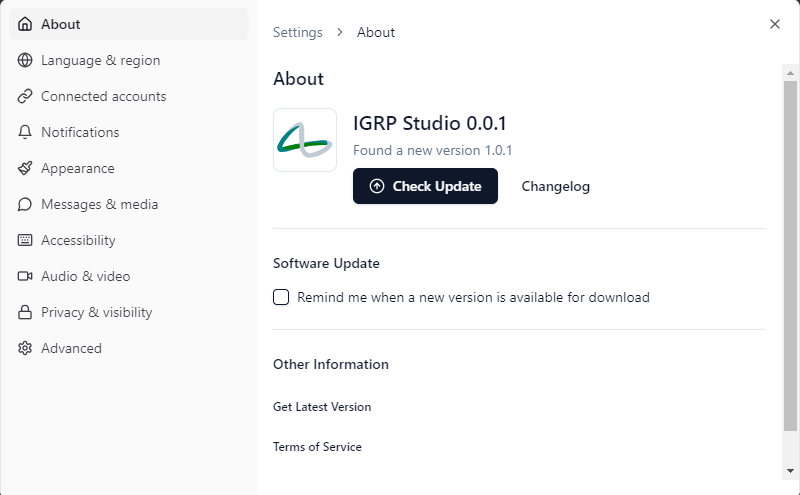

# Configurações 

  

Este ecrã centraliza as principais opções de **gestão e personalização** da experiência do utilizador no **IGRP Studio**.  

## Funcionalidades disponíveis  

📄 - **Secção "Sobre"** - Permite verificar e gerir atualizações, consultar o histórico de alterações, aceder a informações adicionais e visualizar os termos de serviço da aplicação.  
🌍 - **Idioma e Região** – Configuração do idioma e da região da aplicação.  
🔗 - **Contas Conectadas** – Gestão das contas associadas à aplicação.  
🔔 - **Notificações** – Definição das preferências de notificação.  
🎨 - **Aparência** – Personalização do aspeto visual da aplicação.  
📩 - **Mensagens e Multimédia** – Gestão das configurações relacionadas com mensagens e conteúdos multimédia.  
♿ - **Acessibilidade** – Opções para melhorar a acessibilidade.  
🎧 - **Áudio e Vídeo** – Configuração das definições de áudio e vídeo.  
🔒 - **Privacidade e Visibilidade** – Controlo das definições de privacidade e visibilidade.  
⚙️ - **Avançado** – Opções avançadas de configuração.     
