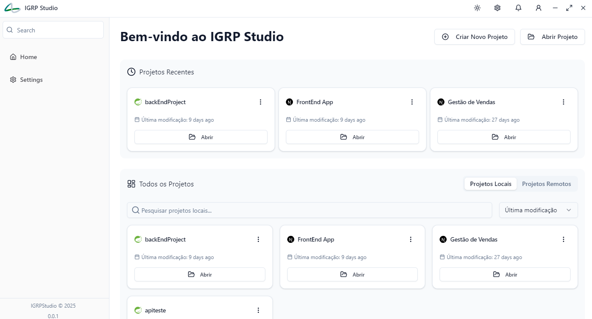

# Bem-vindo ao IGRP Studio  

  

# 📌 Secção "Projetos Recentes"  
Esta secção disponibiliza:  
- **Listagem dos três projetos mais recentes** (FrontEnd e BackEnd) criados, incluindo informações sobre a última modificação e opção de edição.  
- **Remoção de Projetos**: Ao clicar com o botão direito do mouse sobre um projeto, é possível removê-lo, sendo exibido um alerta de confirmação antes da ação.  

# 🔍 Secção "Todos os Projetos"  
Esta secção permite:  
- **Pesquisar projetos locais**: Buscar projetos armazenados localmente. 
- **Pesquisar projetos remotos**: Localizar projetos em repositórios Git.  
- **Filtrar pesquisas**: Por data da última modificação ou pelo nome do projeto.  
- **Listagem geral de projetos**: Exibe todos os projetos (FrontEnd e BackEnd) criados, com detalhes da última modificação e opção de edição.  
- **Remoção de projetos**: Clique com o botão direito do mouse para remover um projeto.  

# ⚙️ Menu Superior  
- **Modos de Exibição**:  
  - Dark Mode 🌙  
  - Light Mode ☀️  
  - System Mode 💻  
- **Configurações**: Permite editar [configurações do IGRP Studio](settings.md)  
- **Notificações**.  
- **Conexão com GitHub e/ou GitLab**.  
- **Criar Novo Projeto**: Permite a criação de um novo projeto BackEnd ou FrontEnd.  
- **Abrir Projeto**: Possibilita a abertura de projetos armazenados localmente.  

# 📌 Menu Lateral  
- **Página Principal**: Retorna à página principal.  
- **Configurações**: Acessa as opções de configuração.  
