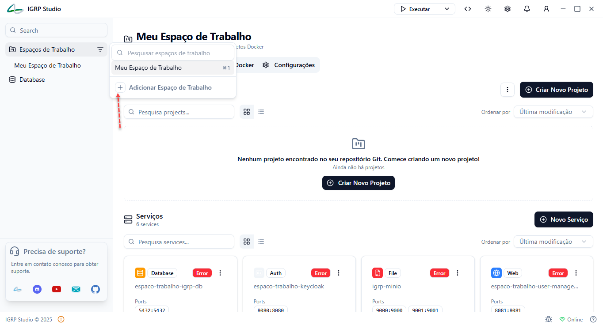
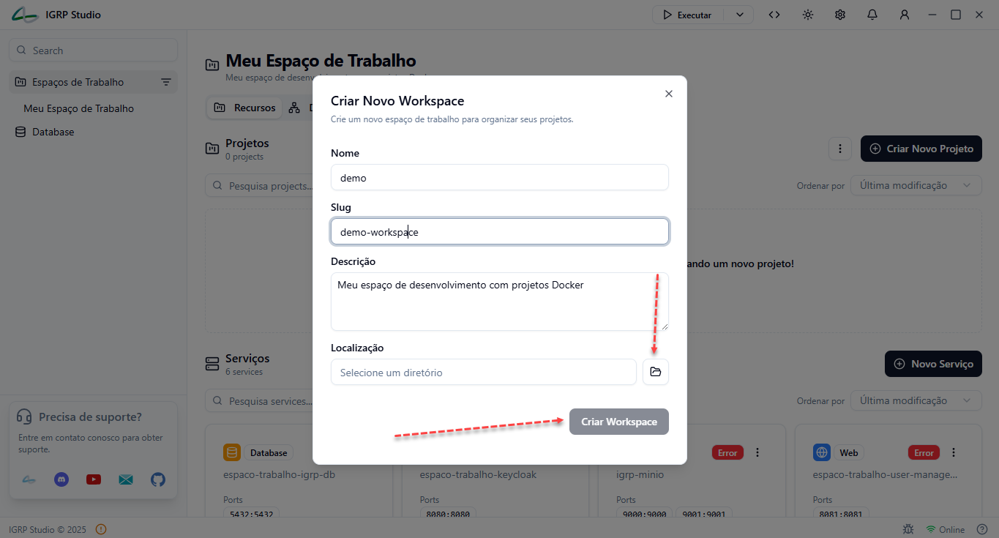

# WorkSpace

## Gerenciamento de WorkSpaces

O WorkSpaces do IGRP Studio permite criar e gerir os **WorkSpaces**, que organizam os projetos de desenvolvimento, FrontEnd e BackEnd, gerados pelos geradores do IGRP Studio.

### Funcionalidades
- Visualizar, criar e pesquisar workspaces existentes
- Aceder às configurações

### Para criar um novo WorkSpace
- **Nome do WorkSpace**
- **Slug** (identificador único)
- **Descrição**
- **Localização** no sistema de ficheiros

