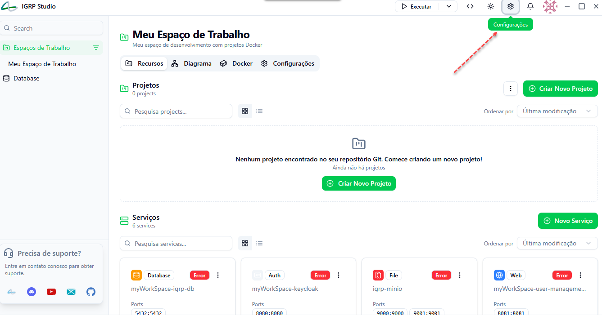
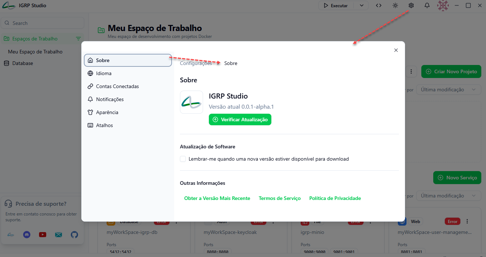
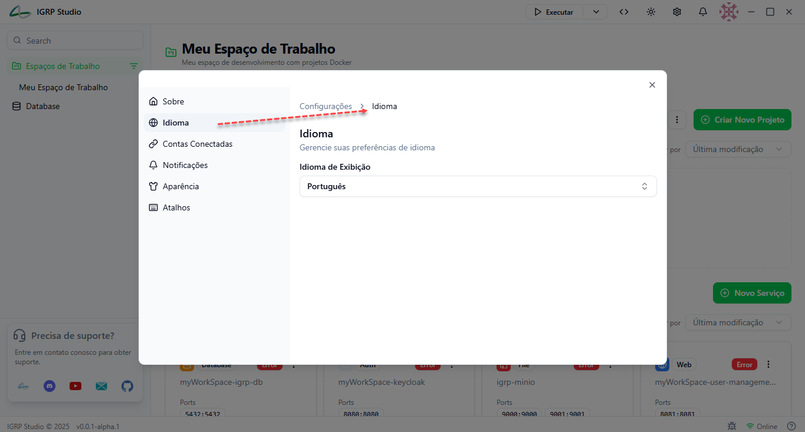
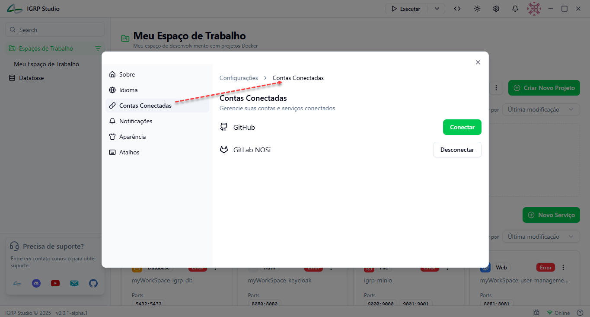
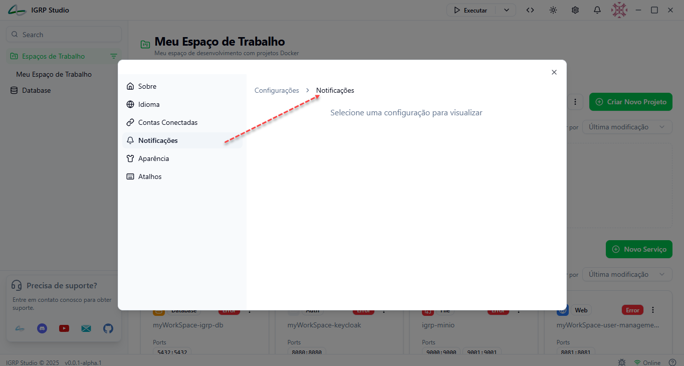
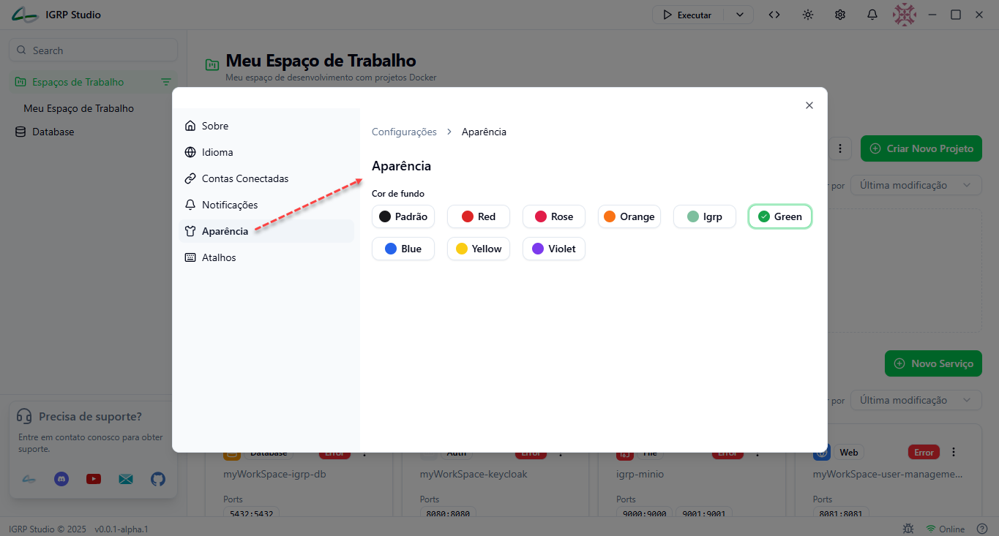
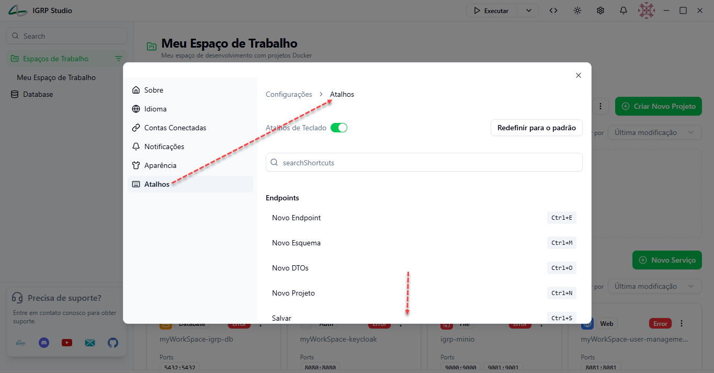

# Configurações

O IGRP Studio disponibiliza uma área de **Configurações** que permite ao utilizador personalizar e gerir aspetos importantes da aplicação, tais como aparência, idioma, contas conectadas, atalhos, notificações, entre outros. Este guia explica cada funcionalidade disponível no menu de configurações e orienta o utilizador sobre como tirar proveito destas opções para melhorar a sua experiência e produtividade.

## Acesso ao Menu de Configurações

Para aceder ao menu de configurações do IGRP Studio, clique no ícone de engrenagem localizado no canto superior direito da interface principal, conforme ilustrado:

<!-- Inserir imagem do ícone de configurações e localização na interface -->

## Opções Disponíveis em Configurações

### Sobre

- Exibe informações gerais da aplicação:
  - Versão atual instalada do IGRP Studio.
  - Botão para verificar se existem atualizações disponíveis.
  - Opção para receber notificações automáticas de novas versões.
  - Links para obter a versão mais recente, termos de serviço e política de privacidade.

<!-- Inserir imagem da aba Sobre -->

### Idioma

- Permite selecionar o idioma de exibição da interface.
- Atualmente disponível a opção para definir o idioma para Português e Inglês.

<!-- Inserir imagem da aba Idioma -->

### Contas Conectadas

- Gestão das contas e serviços integrados no IGRP Studio.
- Permite conectar e desconectar serviços como:
  - GitHub
  - GitLab NOSi

<!-- Inserir imagem da aba Contas Conectadas -->

### Notificações

- Área destinada à configuração das notificações da aplicação.

<!-- Inserir imagem da aba Notificações -->

### Aparência

- Personalização da cor de fundo da interface do IGRP Studio.
- Opções de cores disponíveis:
  - Padrão (default)
  - Red, Rose, Orange, Igrp (verde claro), Green (verde escuro), Blue, Yellow, Violet.
- A cor selecionada é aplicada instantaneamente, proporcionando uma experiência visual adaptada à preferência do utilizador.

<!-- Inserir imagem da aba Aparência -->

### Atalhos

- Configuração e visualização dos atalhos de teclado para diferentes ações no IGRP Studio.
- Permite:
  - Ativar ou desativar atalhos de teclado.
  - Visualizar a lista completa de atalhos agrupados por categorias:
    - Endpoints (Novo Endpoint, Novo Esquema, Novo DTO, Novo Projeto, Salvar, etc.)
    - Abas (Fechar aba, Forçar saída da aba, Alternar abas, Ir para aba específica)
    - Editor de código (Localizar, Substituir)
    - Geral (Alternar barra lateral, Configurações, Quebra, Ocultar janela, Zoom, Ajuda)
  - Redefinir atalhos para o padrão.
  - Editar atalhos personalizados (exemplo: clique para editar uma ação).

<!-- Inserir imagem da aba Atalhos -->

## Considerações para Desenvolvedores

- O módulo de configurações está estruturado com um menu lateral para navegação entre categorias.
- As opções de personalização devem ser persistidas localmente para manter preferências entre sessões.
- A interface é dinâmica, atualizando as configurações instantaneamente ao selecionar opções (exemplo: mudança de cor).
- A funcionalidade de atalhos inclui um mecanismo para redefinir e editar atalhos, permitindo flexibilidade para o utilizador.
- As integrações de contas conectadas facilitam workflows integrados com repositórios Git externos.
- A gestão de atualizações e notificações no menu "Sobre" sugere conectividade com servidor para verificar versões.

