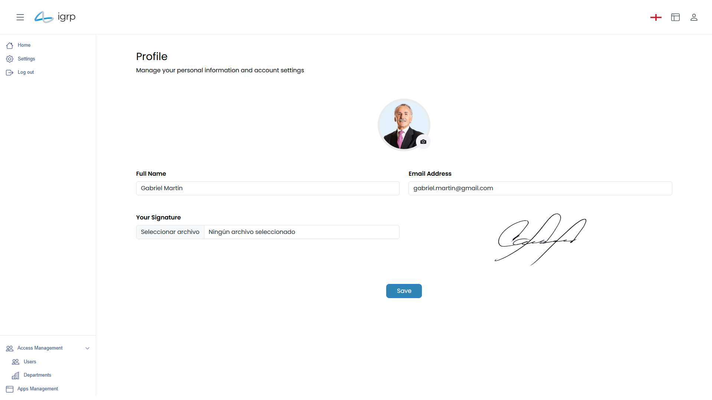

# Gestão de Perfil

Esta seção permite que cada utilizador aceda e faça gestão das suas informações pessoais, configurações e preferências dentro do IGRP. Através desta funcionalidade, é possível atualizar dados, ajustar definições de conta e visualizar permissões atribuídas, garantindo uma experiência personalizada e segura.   
O perfil pode ser acedido através do menu suspenso na barra de navegação, conforme explicado anteriormente neste guia.

### Atualizar Perfil

Neste ecrã, o utilizador pode visualizar e atualizar as suas informações pessoais, incluindo:
- Fotografia de perfil
- Nome
- Email
- Assinatura

Após efetuar as alterações, clique no botão **"Save"**. A informação atualizada será armazenada e ficará visível para outros utilizadores do IGRP, conforme aplicável.
